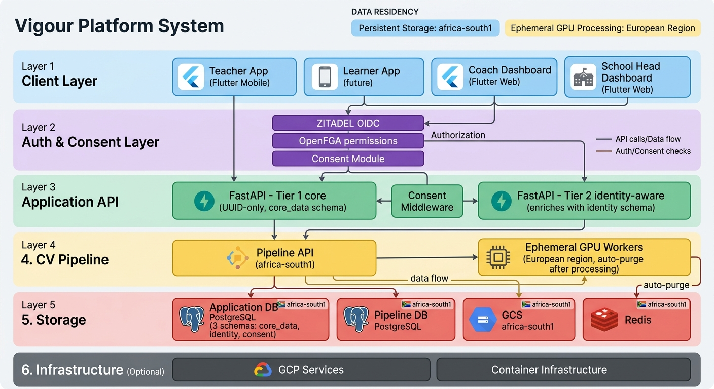
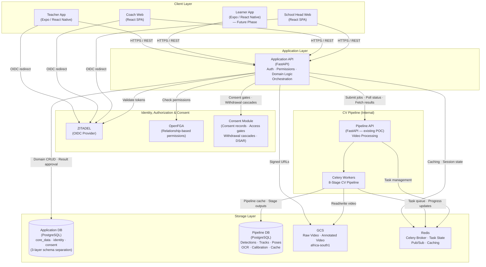

# System Overview

## Vision

Vigour is a multi-tenant platform that automates physical fitness assessments for South African schools. A teacher records video of learners performing fitness tests on their phone, uploads it, and the CV pipeline processes the footage to extract performance data automatically. Results then flow through to students, coaches, and school heads — each with their own view tailored to their role.

The existing proof-of-concept handles the CV pipeline — an 8-stage process (Ingest, Detect, Track, Pose, OCR, Calibrate, Extract, Output) that takes video in and produces structured metrics and annotated video out. This architecture covers everything else needed to turn that pipeline into a product: identity, authorization, multi-tenancy, domain modelling, dashboards, and the client applications that tie it all together.

### Five Fitness Tests (Pipeline-Supported)

| Test | Attribute | Metric | Unit |
|------|-----------|--------|------|
| Vertical Jump | Explosiveness | Jump height | cm |
| 5m Sprint | Speed | Time | seconds |
| Shuttle Run | Fitness | Distance per 15s set | metres |
| Cone Drill | Agility | Completion time | seconds |
| Single-Leg Balance | Balance | Hold duration | seconds |

## System Architecture

> **Note on OIDC flow**: For magic link / email code login, the Application API initiates the ZITADEL passwordless flow on the user's behalf — clients don't talk to ZITADEL directly in that case. The OIDC redirect arrows above apply to the SSO flow (Google/Microsoft sign-in). See [03-authentication.md](./03-authentication.md) for details.

## Service Responsibilities

| Service | Responsibilities |
|---|---|
| **Application API** | User management, school/class/session CRUD, bib-to-student mapping, result ingestion & approval, upload orchestration (task creation + signed URLs), pipeline job coordination |
| **Pipeline API** (internal) | 8-stage CV pipeline orchestration, per-stage caching, annotated video generation. Does not know about users, schools, or permissions. |
| **Celery Workers** | Async execution of CV pipeline stages on GPU. One job at a time per worker (GPU-bound). |
| **ZITADEL** | Authentication, identity, multi-tenant org management (one org per school), magic link / OIDC login, token issuance |
| **OpenFGA** | Relationship-based authorization checks. Enforces who can access which schools, classes, sessions, students, and results. |
| **Consent Module** | Manages consent records and enforces consent-based access gates. Handles consent withdrawal cascades (e.g. IDENTITY_STORAGE withdrawal triggers Layer 2 deletion) and DSAR (Data Subject Access Request) fulfilment. |
| **Application DB** (PostgreSQL) | Three-schema layered design: **core_data** (Layer 1) — anonymised domain entities: students as UUIDs with age_band/gender_category, schools as UUIDs, sessions, clips, results. **identity** (Layer 2) — student/school/user PII, external identifiers (LURITS, UPN), encrypted with Cloud KMS. **consent** (Layer 3) — consent records, audit trail. No cross-schema read permissions. |
| **Pipeline DB** (PostgreSQL) | Pipeline artifacts: detections, tracks, poses, OCR readings, calibration data, raw pipeline results, stage cache |
| **Redis** | Celery task broker, task state tracking, pipeline stage progress pub/sub, application-level caching |
| **GCS** | Raw video storage, annotated video output. Access via signed URLs only — no public buckets. |

> **Database note**: Application DB and Pipeline DB may be separate schemas within a single PostgreSQL instance or separate instances entirely. See [07-infrastructure.md](./07-infrastructure.md) for the current proposal.

## Key Architectural Decisions

- **Privacy by default, identity by module**: The core system operates on anonymous UUIDs with pluggable identity modules. Layer 1 (`core_data` schema) contains no PII — students are UUIDs with age_band and gender_category only. Layer 2 (`identity` schema) maps UUIDs to real-world identities (names, LURITS numbers) and is encrypted with Cloud KMS. Layer 3 (`consent` schema) manages consent records and audit trails. These are separate PostgreSQL schemas with no cross-schema read permissions — the application API joins data in-memory only when consent and authorization checks pass.
- **Data residency**: All PII and primary storage resides in GCP `africa-south1` (Johannesburg). GPU processing occurs on ephemeral VMs in a European region — video is pulled, processed, and the local copy purged on completion. No persistent data storage outside `africa-south1`.
- **Two-tier API**: The public Application API wraps the internal Pipeline API. Clients never talk to the pipeline directly. The pipeline doesn't know about users, schools, or permissions — it just processes video.
- **Auth at the edge**: ZITADEL handles identity. The Application API enforces permissions via OpenFGA on every request. No row-level security in Postgres — authorization lives in the application layer.
- **Contract-based onboarding**: No self-signup. Schools are provisioned by a super admin after a contract is signed. Users are pre-approved per school.
- **Students are managed, not self-service**: Students are created by teachers. For the Learner App (future phase), students authenticate via the same model as other users — magic link or school SSO. No separate auth system needed.
- **Parent/guardian role**: Parents authenticate via magic link, manage consent for their children, and optionally view their child's results. Consent management is the primary function — without active parental consent, the identity layer cannot map a UUID to a real student.
- **Students own their results**: Results are linked to a student UUID in Layer 1 (`core_data`). When a student transfers schools, the old school loses access (OpenFGA tuples deleted), the new school sees only new results unless explicitly granted historical access. On consent withdrawal (IDENTITY_STORAGE), the Layer 2 identity mapping is deleted and Layer 1 results become orphaned/anonymous — the UUID becomes meaningless without the identity mapping, achieving effective erasure while preserving aggregate data integrity.
- **Pipeline stays isolated**: The CV pipeline remains a standalone service. The Application API submits jobs and ingests results — it does not modify pipeline internals. The integration boundary is defined in [08-pipeline-integration.md](./08-pipeline-integration.md).
- **Upload flow — task before upload (Option B)**: The client requests an upload from the Application API, which creates a task record and returns both a task ID and a signed GCS URL in one response. The client then uploads directly to cloud storage (no video bytes through the API). On completion, the client confirms the upload, which triggers pipeline processing. This ensures: the client always has a task handle, orphaned uploads are trackable, and every state is recoverable.
- **POPIA compliance**: The platform handles minor students' personal data. Individual student data is never exposed beyond the school that owns it. See [04-authorization.md](./04-authorization.md).

## Cross-Cutting Concerns

- **POPIA / Data Privacy**: All student data is PII for minors. Access is strictly scoped by school via OpenFGA. See [04-authorization.md](./04-authorization.md).
- **Offline Capability**: The Teacher App must support offline session setup and bib assignment using local storage (`expo-file-system` / AsyncStorage). Video uploads are queued when connectivity resumes. See [05-client-applications.md](./05-client-applications.md).
- **Monitoring & Observability**: Structured logging with correlation IDs, Cloud Monitoring for services, alerting on pipeline failures and auth errors. See [07-infrastructure.md](./07-infrastructure.md).
- **Test Results**: Raw performance data (cm, s, m) from the five fitness tests. Drives the Learner App dashboard, coach dashboards, school dashboards, and at-risk flagging. See [01-domain-model.md](./01-domain-model.md).

## Document Map

| Document | Description |
|----------|-------------|
| [01 — Domain Model](./01-domain-model.md) | Entities, relationships, ERD. Schools, students, classes, bib assignments, results. |
| [02 — API Architecture](./02-api-architecture.md) | Two-tier API design. Route groups, request flows, video upload and result ingestion sequences. |
| [03 — Authentication](./03-authentication.md) | ZITADEL setup, login flows (magic link + OIDC), multi-tenant orgs, token handling. |
| [04 — Authorization](./04-authorization.md) | OpenFGA model, permission checks, relationship lifecycle, student transfers. |
| [05 — Client Applications](./05-client-applications.md) | All surfaces: Teacher App, Learner App, Coach Web, School Head Web. |
| [06 — Data Flow](./06-data-flow.md) | End-to-end data lifecycle, session states, result approval, data aggregation, video flow. |
| [07 — Infrastructure](./07-infrastructure.md) | GCP services, Docker Compose for dev, database strategy, GCS buckets, scaling, monitoring. |
| [08 — Pipeline Integration](./08-pipeline-integration.md) | Integration boundary with the CV pipeline. Job submission, result ingestion, cache management. |
| [data-privacy-decisions](../research/data-privacy-decisions.md) | Privacy architecture decisions: Layer 1/2/3 separation, consent model, data residency, POPIA compliance strategy. |

### Resolved Decisions

| Decision | Resolution | Decided In |
|----------|-----------|------------|
| Video upload path | Direct to GCS via signed URL. Task created before upload (Option B). API never touches video bytes. | This doc + [02-api-architecture.md](./02-api-architecture.md) |
| Real-time pipeline progress vs polling | Polling for MVP. WebSocket/pub-sub as future enhancement. | [08-pipeline-integration.md](./08-pipeline-integration.md) |
| Database topology | Single Postgres instance, separate schemas (`app` + `pipeline`). Separate instances can come later if needed. | Architecture review |
| Authorization system | OpenFGA. SpiceDB's stronger consistency isn't needed for this use case. | Architecture review |
| ZITADEL hosting | Self-hosted. Keeps control over data and avoids vendor dependency. | Architecture review |
| Application API hosting | Cloud Run. Simpler than GKE — deploy via scripts, scale to zero, no cluster management. | Architecture review |
| Student / Learner App auth | Same model as other users: magic link (emailed) or school account SSO. Students get accounts when Learner App launches. | Architecture review |
| Additional test types | Deferred to ML team. API is test-type-agnostic — new types are just new enum values. | Architecture review |
