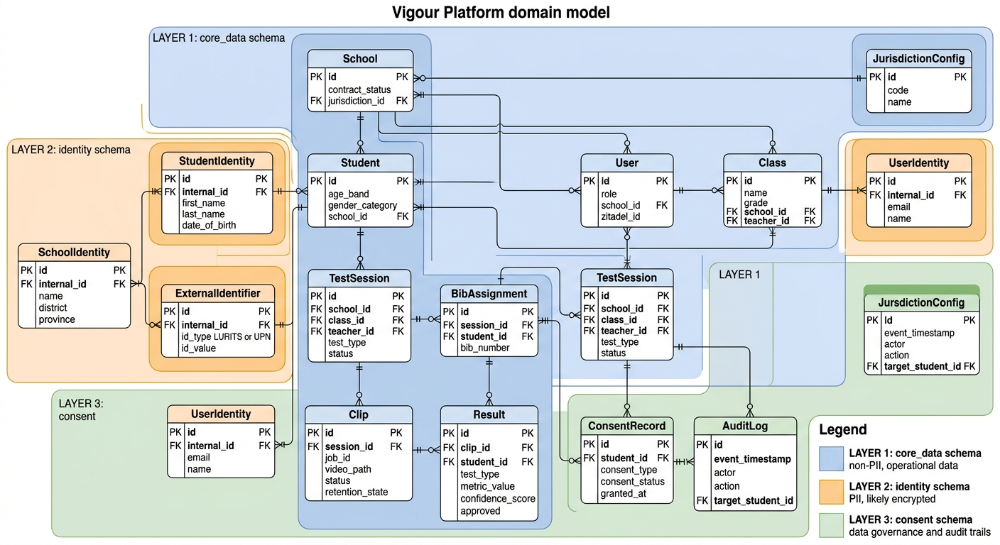
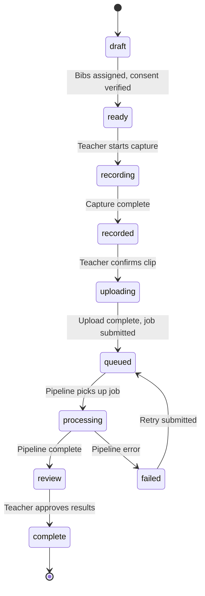

# Domain Model

## Overview

The domain model defines the core entities of the Vigour platform. The existing POC operates with a minimal set of concepts: **sessions**, **clips**, and **results**, with bib numbers serving as the only form of identity. There is no concept of a school, a teacher, or even a named student — just numbered bibs detected by OCR.

The full application needs a richer model to support multi-tenancy, user management, and longitudinal tracking. The foundational design principle is **privacy by default, identity by module** — the core data layer knows what a student did, never who they are. All personally identifiable information lives in a separate identity layer.

The domain model is organised into three PostgreSQL schemas within a single Cloud SQL instance:

- **`core_data`** (Layer 1) — Anonymised performance data. UUIDs, fitness scores, sessions, clips. No PII. This schema is jurisdiction-agnostic and identical in every deployment.
- **`identity`** (Layer 2) — Student and school PII. Names, dates of birth, external identifiers (LURITS, UPN). Pluggable per jurisdiction. Encrypted at rest with Cloud KMS.
- **`consent`** (Layer 3) — Consent records, audit trails. Jurisdiction-specific consent logic. Separate access controls from both Layer 1 and Layer 2.

This separation is enforced by dedicated database roles with no cross-schema read permissions. Layer 1 cannot read Layer 2. The identity module wraps the core, not the other way around.

See [Modular Data Architecture](../research/modular-data-architecture.md) for the full 5-layer model (including Layer 0: Ephemeral Processing and Layer 4: Reporting & Analytics) and the research behind this design.

---

## Entity Relationship Diagram

```mermaid
erDiagram
    %% ═══════════════════════════════════════════
    %% LAYER 1: core_data schema (no PII)
    %% ═══════════════════════════════════════════

    core_data_School {
        UUID id PK
        string contract_status "active | suspended | expired"
        UUID jurisdiction_id FK
        timestamp created_at
        timestamp updated_at
    }

    core_data_Student {
        UUID id PK
        string age_band "e.g. 12-13"
        string gender_category "M | F"
        UUID school_id FK
        timestamp created_at
        timestamp updated_at
    }

    core_data_User {
        UUID id PK
        string role "teacher | coach | school_head | parent | super_admin"
        UUID school_id FK "null for super_admin"
        string zitadel_id "ZITADEL user identifier"
        timestamp created_at
    }

    core_data_Class {
        UUID id PK
        string name "e.g. 6A"
        string grade
        UUID school_id FK
        UUID teacher_id FK
        int academic_year
    }

    core_data_ClassStudent {
        UUID class_id FK
        UUID student_id FK
    }

    core_data_TestSession {
        UUID id PK
        UUID school_id FK
        UUID class_id FK
        UUID teacher_id FK
        string test_type "explosiveness | speed | fitness | agility | balance"
        date session_date
        string status "draft | ready | recording | recorded | uploading | queued | processing | review | complete | failed"
        timestamp created_at
    }

    core_data_BibAssignment {
        UUID id PK
        UUID session_id FK
        UUID student_id FK
        int bib_number "1-30"
        timestamp assigned_at
    }

    core_data_Clip {
        UUID id PK
        UUID session_id FK
        string job_id "pipeline job ID, set after submission"
        string video_path "GCS path: raw/{school_id}/{session_id}/{clip_id}.mp4"
        string annotated_video_path "GCS path, set after pipeline completes"
        string status "pending | uploading | queued | processing | complete | failed"
        string retention_state "hot | cold | deletion_pending"
        timestamp retention_transitioned_at "when retention state last changed"
        string pipeline_version "version of pipeline that processed this clip"
        timestamp created_at
        timestamp completed_at
    }

    core_data_Result {
        UUID id PK
        UUID clip_id FK
        UUID student_id FK "null if bib unresolved"
        UUID bib_assignment_id FK "null if bib unresolved"
        int bib_number "OCR-detected bib from pipeline"
        int track_id "pipeline tracking ID, for debugging"
        string test_type "explosiveness | speed | fitness | agility | balance"
        float metric_value
        string metric_unit "cm | s | m"
        int attempt_number
        float confidence_score "0.0-1.0"
        text_array flags "e.g. bib_unresolved, low_pose_confidence"
        jsonb raw_data "stage-level debug data — must NOT contain raw skeletal keypoints"
        boolean approved "null = pending, true = approved, false = rejected"
        UUID approved_by FK "teacher user_id who approved"
        timestamp created_at
    }

    core_data_JurisdictionConfig {
        UUID id PK
        string code "ZA, GB, EU"
        string name
        int consent_age_threshold "default 18"
        string default_privacy_level "default high"
        int video_hot_storage_days "default 90"
        int video_max_retention_days "NULL = retain with metrics"
        int metrics_retention_years "default 7"
        boolean profiling_enabled_by_default "default false"
        string result_sharing_default "default private"
        jsonb identity_id_types "e.g. ['LURITS'] for ZA, ['UPN'] for GB"
        boolean requires_dpia "default false"
        boolean requires_explicit_consent "default false"
        timestamp created_at
    }

    %% ═══════════════════════════════════════════
    %% LAYER 2: identity schema (PII, encrypted)
    %% ═══════════════════════════════════════════

    identity_StudentIdentity {
        UUID id PK
        UUID internal_id FK "references core_data.Student.id"
        string first_name "encrypted"
        string last_name "encrypted"
        date date_of_birth "encrypted"
        string grade "encrypted"
        string gender "encrypted"
        timestamp created_at
        timestamp updated_at
    }

    identity_ExternalIdentifier {
        UUID id PK
        UUID internal_id FK "references core_data.Student.id"
        string id_type "LURITS | UPN | SA_ID | SCHOOL_NUMBER"
        string id_value "encrypted"
        timestamp created_at
    }

    identity_SchoolIdentity {
        UUID id PK
        UUID internal_id FK "references core_data.School.id"
        string name "encrypted"
        string district "encrypted"
        string province "encrypted"
        string address "encrypted"
        timestamp created_at
        timestamp updated_at
    }

    identity_UserIdentity {
        UUID id PK
        UUID internal_id FK "references core_data.User.id"
        string email "encrypted — also in ZITADEL"
        string name "encrypted — also in ZITADEL"
        timestamp created_at
    }

    %% ═══════════════════════════════════════════
    %% LAYER 3: consent schema
    %% ═══════════════════════════════════════════

    consent_ConsentRecord {
        UUID id PK
        UUID student_id FK "internal UUID"
        string consenting_party "encrypted — parent or guardian name"
        string consenting_party_role "PARENT | LEGAL_GUARDIAN"
        string consent_type "VIDEO_CAPTURE | METRIC_PROCESSING | IDENTITY_STORAGE | DATA_SHARING | REPORTING | LONG_TERM_RETENTION | MODEL_TRAINING (deferred)"
        string consent_status "GRANTED | WITHDRAWN | EXPIRED"
        timestamp granted_at
        timestamp withdrawn_at "nullable"
        timestamp expires_at "nullable"
        string consent_method "DIGITAL_FORM | PAPER_FORM"
        string consent_evidence "reference to stored form"
        string jurisdiction "ZA | GB"
        string consent_version
        timestamp created_at
    }

    consent_AuditLog {
        UUID id PK
        timestamp event_timestamp
        string actor "system | admin UUID | parent UUID"
        string action "CONSENT_GRANTED | CONSENT_WITHDRAWN | DSAR_RECEIVED | DSAR_FULFILLED | DATA_DELETED | BREACH_DETECTED"
        UUID target_student_id "student UUID affected"
        jsonb details "action-specific metadata"
        string jurisdiction
    }

    %% ═══════════════════════════════════════════
    %% RELATIONSHIPS
    %% ═══════════════════════════════════════════

    %% Layer 1 relationships
    core_data_School ||--o{ core_data_Student : "enrols"
    core_data_School ||--o{ core_data_Class : "contains"
    core_data_School ||--o{ core_data_TestSession : "hosts"
    core_data_School ||--o{ core_data_User : "employs"
    core_data_School }o--|| core_data_JurisdictionConfig : "governed by"

    core_data_Class ||--o{ core_data_ClassStudent : "includes"
    core_data_Student ||--o{ core_data_ClassStudent : "belongs to"
    core_data_User ||--o{ core_data_Class : "teaches"

    core_data_TestSession }o--|| core_data_Class : "tests"
    core_data_TestSession }o--|| core_data_User : "run by"

    core_data_TestSession ||--o{ core_data_BibAssignment : "assigns"
    core_data_Student ||--o{ core_data_BibAssignment : "wears"

    core_data_TestSession ||--o{ core_data_Clip : "produces"

    core_data_Clip ||--o{ core_data_Result : "yields"
    core_data_Student ||--o{ core_data_Result : "achieves"
    core_data_BibAssignment ||--o{ core_data_Result : "resolves to"
    core_data_User ||--o{ core_data_Result : "approves"

    %% Layer 2 relationships (cross-schema via UUID, not FK)
    core_data_Student ||--o| identity_StudentIdentity : "identified by"
    core_data_Student ||--o{ identity_ExternalIdentifier : "mapped to"
    core_data_School ||--o| identity_SchoolIdentity : "identified by"
    core_data_User ||--o| identity_UserIdentity : "identified by"

    %% Layer 3 relationships (cross-schema via UUID, not FK)
    core_data_Student ||--o{ consent_ConsentRecord : "consented for"

```

---

## Schema Separation

The three schemas enforce structural data minimisation. This is a logical separation within a single Cloud SQL instance for MVP, with the option to move to physical separation later.

| Schema | Layer | Contains | Database Role | Can Read |
|--------|-------|----------|---------------|----------|
| `core_data` | Layer 1 | Students (UUID + age_band + gender_category), schools (UUID + contract_status), sessions, clips, results, bib assignments, jurisdiction config | `vigour_core` | `core_data` only |
| `identity` | Layer 2 | Student PII (names, DOB, grade, gender), external identifiers (LURITS, UPN), school PII (name, district, province), user PII (email, name) | `vigour_identity` | `identity` only |
| `consent` | Layer 3 | Consent records, audit trail | `vigour_consent` | `consent` only |

**Cross-schema access:** No database role has read access to another schema. The application API mediates all cross-layer joins. The Tier 2 (identity-aware) API routes call Layer 1 for data, then separately call Layer 2 for enrichment — the join happens in application code, never in SQL.

**Exception:** The DSAR handler is a privileged process with read access to all three schemas, for data export and deletion requests.

---

## Test Type Reference

The pipeline defines five fitness tests. The `test_type` field on `TestSession` and `Result` uses the attribute name as the canonical identifier.

| Test Name | test_type value | Attribute | Metric | Unit |
|-----------|----------------|-----------|--------|------|
| Vertical Jump | `explosiveness` | Explosiveness | Jump height | cm |
| 5m Sprint | `speed` | Speed | Time | s |
| Shuttle Run | `fitness` | Fitness | Distance per 15s set | m |
| Cone Drill (T-drill) | `agility` | Agility | Completion time | s |
| Single-Leg Balance | `balance` | Balance | Hold duration | s |

---

## Key Design Decisions

- **Privacy by default, identity by module.** The core system operates on UUIDs only. It goes from "Bib 7 ran 12.3 seconds" to "UUID-abc123's sprint time improved by 0.4s since last term." The identity module (Layer 2) adds the human-readable layer: "Thabo Molefe's sprint time improved by 0.4s." This enrichment happens at the API boundary, not in the data layer.

- **Students are not users.** They do not have accounts and they do not log in. Students are represented in the core system as anonymous UUIDs with age_band and gender_category. Their identity is managed through the Layer 2 identity module, and they are created and managed by teachers through the Teacher App. If a Learner App is introduced in a future phase, student accounts would be a new concern layered on top of this model.

- **Age band and gender category, not exact DOB.** Layer 1 stores `age_band` (e.g., "12-13") and `gender_category` (e.g., "M") — derived from the exact DOB and gender at write time. These are sufficient for fitness score interpretation (normative tables are age- and gender-stratified) while minimising re-identification risk. Exact DOB and detailed gender live in Layer 2 only.

- **School identity is also split.** Layer 1 stores only the school UUID and contract status. School name, district, and province are PII (they enable re-identification when combined with student data) and live in Layer 2. The school UUID in Layer 1 is opaque without Layer 2 access.

- **Bib assignment is per-session.** Student A might wear Bib 7 in Monday's session and Bib 12 on Wednesday. The `BibAssignment` table is the bridge between the bib number detected by OCR in the pipeline and an internal student UUID. BibAssignment lives in Layer 1 — it contains session_id, student_id (UUID), and bib_number, none of which are PII.

- **Results belong to students, not bibs.** Once a teacher reviews and approves a result, it is permanently linked to a `student_id` (UUID). This makes results portable — if a student transfers to a new school, their historical results travel with them via the UUID.

- **Raw scores only in the data layer.** The `Result` entity stores raw metric values (cm, s, m) and confidence scores. Categorical labels, percentiles, risk flags, and normative comparisons are computed in the presentation layer, not stored. This avoids encoding scoring decisions into the data model and prevents "profiling" concerns under UK AADC.

- **Raw skeletal keypoints are NOT stored.** The `raw_data` field on `Result` may contain stage-level debug data (e.g., calibration parameters, OCR confidence) but must NOT contain raw skeletal keypoint sequences. Skeletal data is intermediate processing output — the derived metric (time, count, distance) is stored, the keypoints are discarded. This is a compliance requirement: temporal accumulation of skeletal data creates increasingly identifying biometric profiles.

- **UUID for student identity.** Students are identified by system-generated UUIDs — the stable, lifelong anchor for all results. External identifiers (LURITS numbers for SA, UPNs for UK) are stored in Layer 2's `ExternalIdentifier` table. A student can have multiple external identifiers.

- **Consent gates processing.** A student cannot participate in a test session unless active `VIDEO_CAPTURE` and `METRIC_PROCESSING` consent exists. `IDENTITY_STORAGE` is additionally required for their results to be linked to their identity. The consent module (Layer 3) is checked before operations, not just at collection time.

- **Upload flow (Option B).** The Clip record is created before the video upload begins. The Application API creates the Clip (status = `pending`), generates a signed GCS URL, and returns both `clip_id` and the upload URL to the client. The client uploads directly to GCS, then confirms. This ensures every upload attempt is trackable and orphaned uploads are recoverable. See [02-api-architecture.md](./02-api-architecture.md) for the sequence diagram.

- **Video retention tied to metrics.** The `retention_state` field on `Clip` tracks the video lifecycle: `hot` (0-90 days, active access), `cold` (90+ days, audit-logged retrieval only), `deletion_pending`. Video is deleted when linked metrics are deleted or on consent withdrawal — not on a fixed time limit. The `jurisdiction_config` table can override this with a maximum retention period where required.

- **Pipeline version on every clip.** The `pipeline_version` field on `Clip` records which version of the CV pipeline processed the video. This is essential for re-processing decisions, result provenance, and dispute resolution.

---

## Session Lifecycle

The `TestSession.status` field tracks the session through its full lifecycle. These states align with [06-data-flow.md](./06-data-flow.md).

| Status | Description |
|--------|-------------|
| `draft` | Session created, class and test type selected. No bibs assigned yet. |
| `ready` | Bib assignments complete. All assigned students have verified `VIDEO_CAPTURE` + `METRIC_PROCESSING` consent. Teacher can begin recording. |
| `recording` | Teacher is actively capturing video. |
| `recorded` | Capture complete. Teacher reviews clip before uploading. |
| `uploading` | Video uploading to GCS via signed URL. Audio and GPS/device metadata are stripped at this stage (before upload or immediately after). |
| `queued` | Upload complete. Job submitted to pipeline, awaiting processing. |
| `processing` | CV pipeline is actively processing the video (8 stages). Processing occurs on ephemeral GPU VMs — see [07-infrastructure.md](./07-infrastructure.md). |
| `review` | Pipeline complete. Results matched to students, awaiting teacher approval. |
| `complete` | Teacher has approved results. Results linked to student UUIDs. |
| `failed` | Pipeline error. Teacher can retry or re-record. |

---

## Bib Assignment Workflow

The bib assignment workflow is the critical link between the CV pipeline (which only knows about bib numbers) and the application (which knows about student UUIDs). This aligns with the result ingestion flow in [08-pipeline-integration.md](./08-pipeline-integration.md).

1. **Before the session** — The teacher opens the Teacher App and assigns bibs to students for the upcoming test session. For example: Bib 1 to student UUID-abc, Bib 2 to student UUID-def, and so on. This creates `BibAssignment` records linking `session_id` + `student_id` (UUID) + `bib_number`. The system verifies that all assigned students have active `VIDEO_CAPTURE` + `METRIC_PROCESSING` consent. Session status moves from `draft` to `ready`.

2. **During recording** — The teacher records the test. Session status moves through `recording` to `recorded`.

3. **Upload** — The teacher confirms the clip. The Application API creates a `Clip` record (status = `pending`), generates a signed GCS upload URL, and returns `clip_id` + URL. Audio is stripped and GPS/device metadata is removed from the video file (either client-side before upload or server-side immediately after). The client uploads directly to GCS, then confirms upload completion. The Application API submits the job to the Pipeline API, stores the returned `job_id` on the Clip, and updates Clip status to `queued`. Session status moves to `queued`.

4. **Pipeline processing** — The CV pipeline processes the clip through 8 stages (Ingest, Detect, Track, Pose, OCR, Calibrate, Extract, Output). Pipeline results reference bib numbers only via the `student_bib` field — the pipeline has no concept of students. Processing occurs on ephemeral GPU VMs in a European region; the local video copy is auto-purged on completion.

5. **Result ingestion** — After processing completes, the Application API fetches results from the Pipeline API (`GET /results/{job_id}`). For each `TestResult`, it looks up the `BibAssignment` for the session using the `student_bib` value to resolve `student_id` (UUID). For each resolved student, the system verifies active `METRIC_PROCESSING` consent before storing. Results with unresolved bibs (`student_bib = -1` or no matching BibAssignment) are created with `student_id = NULL` and flagged for manual review. Session status moves to `review`.

6. **Teacher review** — The teacher opens the Results Processing screen and sees matched results with confidence scores. The identity-aware API (Tier 2) enriches UUIDs with student names from Layer 2 for display. Teachers approve correct matches, manually fix mismatches (e.g. OCR misread "7" as "1"), and flag anything suspicious. A bulk "Approve All High Confidence" action is available for results with `confidence_score > 0.8`. Each approval sets `approved = true` and `approved_by` on the Result.

7. **Commit** — Once the teacher commits results, session status moves to `complete`. Approved results are permanently linked to student UUIDs in Layer 1.

---

## Consent Workflow

Consent collection is a prerequisite for any data processing. The flow is documented in detail in [Data Privacy Decisions](../research/data-privacy-decisions.md), Section 5.

**Summary:** School onboarding → Class creation → Consent form distribution to parents → Parent registration (digital or paper) → Granular consent selection per consent type → Verification → Students with active consent can participate.

**Minimum consent for participation:** `VIDEO_CAPTURE` + `METRIC_PROCESSING`. Without these, the student cannot be recorded. `IDENTITY_STORAGE` is additionally required for results to be linked to their identity in Layer 2 — without it, results are stored as anonymous data.

**Paper consent (SA MVP):** Paper forms are digitised by the school administrator via the admin interface — manual entry of consent record with upload of the signed form as evidence. The consent record is timestamped and marked as `consent_method: PAPER_FORM`.

**Consent withdrawal:** Triggers cascading actions — see [Modular Data Architecture](../research/modular-data-architecture.md), Layer 3 for the full withdrawal cascade. Key consequence: withdrawing `IDENTITY_STORAGE` consent deletes Layer 2 records; Layer 1 data becomes orphaned and truly anonymous.

---

## School Transfers

When a student changes school, their `core_data.Student` record is re-associated with the new `school_id`. All historical `Result` records remain attached to their UUID. The old school loses access via OpenFGA tuple deletion (see [04-authorization.md](./04-authorization.md)). The new school gains access to the student and future sessions but does NOT automatically see historical results from the old school — explicit access sharing would be required. The Layer 2 `StudentIdentity` and `ExternalIdentifier` records are updated by the receiving school. The student's LURITS (or UPN) remains the same — external identifiers are designed to be persistent across schools.

**Phase:** Deferred. The UUID-based architecture supports transfers by design, but the transfer flow (including consent re-collection at the new school) is not an MVP requirement.

---

## Open Questions

- **Do students eventually get their own accounts?** The Learner App concept implies students viewing their own results and progress. This would require student authentication, parental consent flows, and POPIA/GDPR considerations for minors. See system overview open question #6.

- **Should we support multiple academic terms and years with historical comparison?** Results have session dates and terms, implying yes. But the UI and reporting implications of multi-year longitudinal data need to be designed.

- **How granular is at-risk flagging?** Is a student flagged as at-risk based on overall test result trends, or on individual tests (e.g. poor shuttle run but strong sprint)? Per-test flagging is more actionable; overall flagging is simpler. The School Head dashboard (see [05-client-applications.md](./05-client-applications.md)) shows "students declining over 2+ sessions" as the current at-risk definition. Note: at-risk labels are a presentation-layer concern and are NOT stored in the data layer.

- **Scoring and benchmarking?** How test results are scored, compared, and benchmarked is a product decision that has not yet been specified. The platform stores raw test results (cm, s, m) and can support whatever scoring system is defined in the future. Labels, categories, and normative comparisons are applied in the presentation layer only — they are not persisted. This is a deliberate constraint to avoid AADC profiling concerns for UK expansion.
