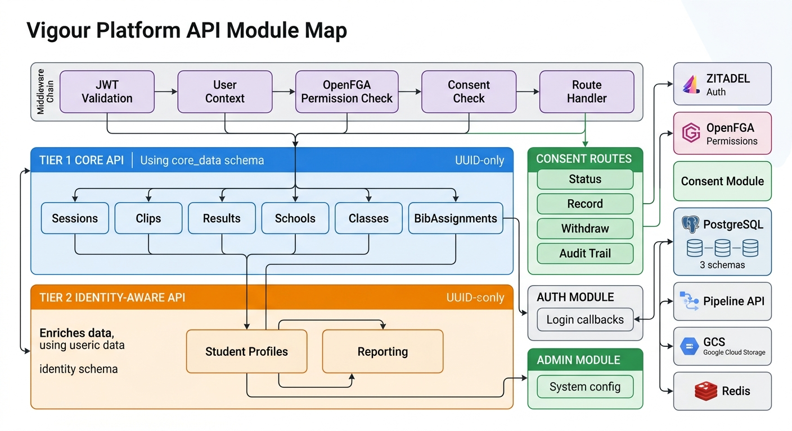
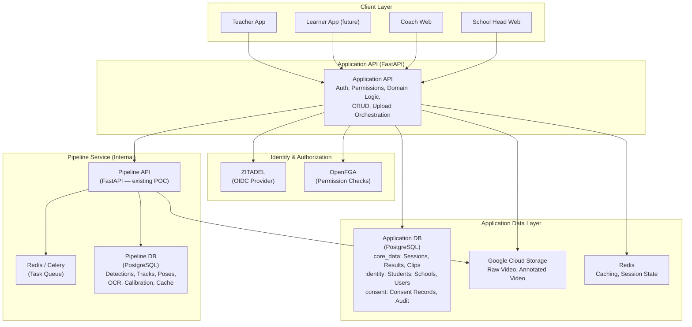
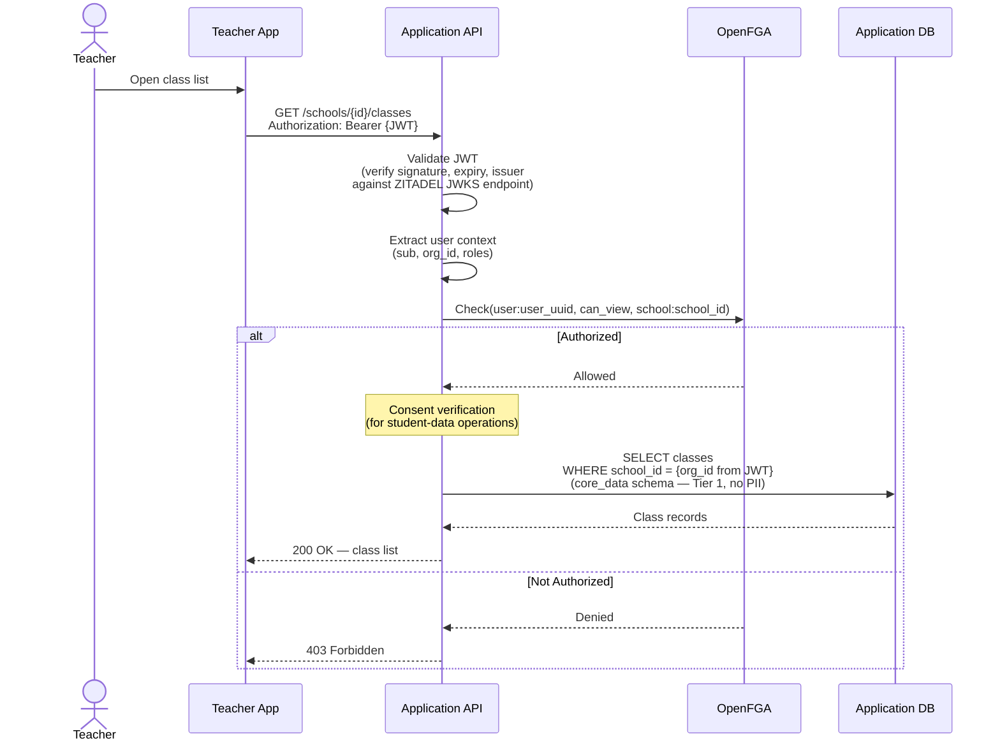
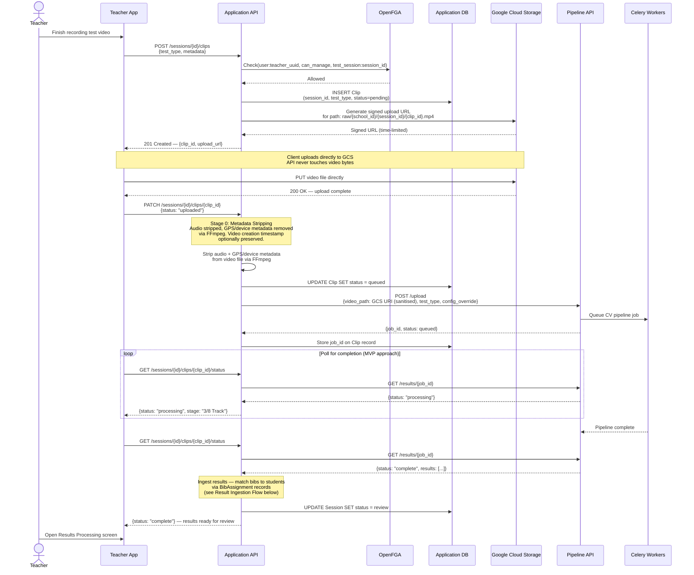
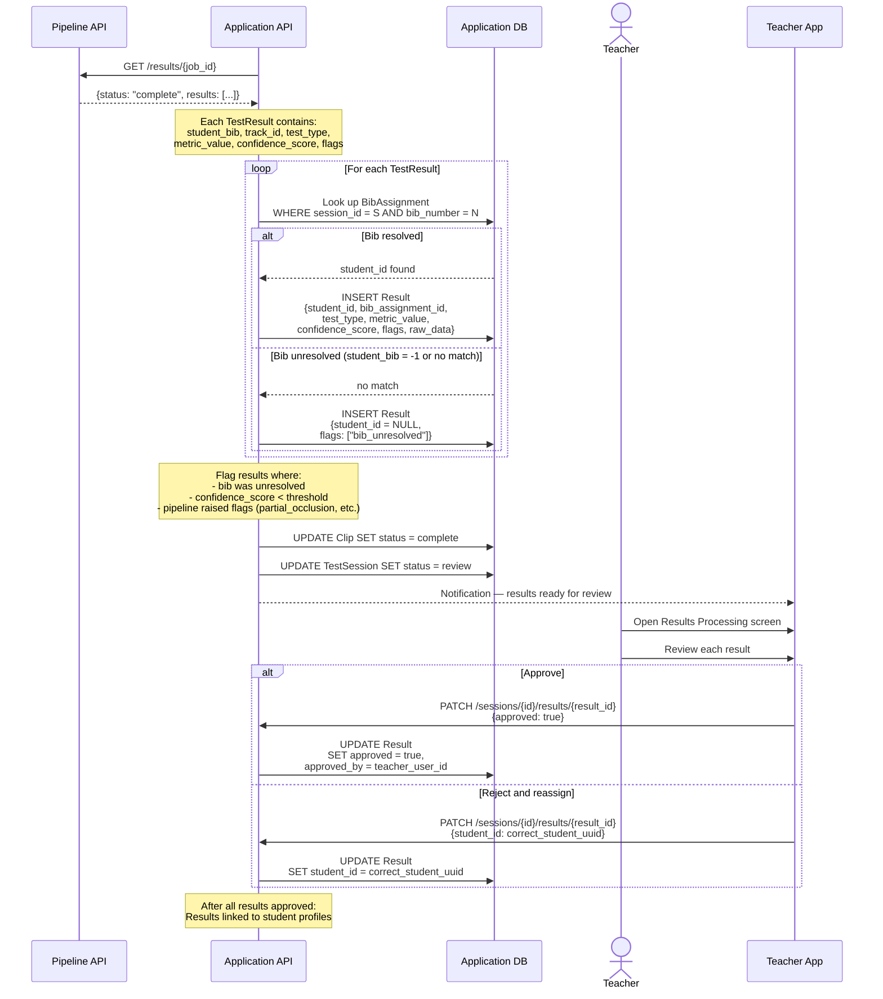
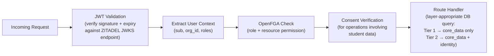

# API Architecture

## Overview

Vigour uses a two-tier API design that separates public-facing domain logic from internal CV pipeline processing. The two APIs are **separate services** — they share no code, no process, and no deployment unit.

**Application API** (public-facing) — Handles authentication, authorization, domain logic, CRUD for schools/classes/students/sessions, bib-to-student mapping, result ingestion and approval, and upload orchestration (task creation + signed URLs). All client applications talk exclusively to this API.

**Pipeline API** (internal) — The existing POC FastAPI service that orchestrates the 8-stage CV pipeline (Ingest, Detect, Track, Pose, OCR, Calibrate, Extract, Output) and generates annotated video. Only the Application API calls the Pipeline API — clients never interact with it directly. The pipeline does not know about users, schools, or permissions.

This separation keeps the pipeline focused on what it does well (computer vision processing) while the Application API handles everything needed to make Vigour a multi-tenant product: identity, permissions, and domain modelling.

### Tier 1 / Tier 2 API Separation

The Application API is a single FastAPI application with two logical tiers that enforce privacy-by-design:

**Tier 1 (Core API)** — Operates exclusively on the `core_data` schema. Returns UUIDs, never PII. Routes like `/sessions`, `/clips`, `/results` work with anonymous identifiers only. All domain logic (session lifecycle, pipeline orchestration, result ingestion) lives here. Tier 1 endpoints have no access to student names, dates of birth, or any other personally identifiable information.

**Tier 2 (Identity-Aware API)** — Wraps Tier 1 functionality with PII enrichment from the `identity` schema. Routes like `/students/{id}/profile` call Tier 1 for data, then enrich with student names, DOB, etc. from the `identity` schema. The join between anonymous data and identity data happens in application code — never in SQL. This ensures that a single compromised query cannot leak both operational data and PII simultaneously.

This separation means:
- Tier 1 can be developed and tested without any PII in the database
- Tier 2 routes are a smaller, auditable surface area for privacy review
- Consent checks (see below) only need to gate Tier 2 access
- The `identity` schema can be encrypted at rest independently

### Two-Database Boundary

Data is split across two logical databases (which may share a single PostgreSQL instance — see [07-infrastructure.md](./07-infrastructure.md)):

| Database | Owner | Contents |
|----------|-------|----------|
| **Application DB** | Application API | Three schemas: `core_data` (sessions, clips, results, bib assignments — all UUID-referenced), `identity` (student names, DOB, school enrolment — PII), `consent` (consent records, audit trail) |
| **Pipeline DB** (`vigour_pipeline`) | Pipeline API | Detections, tracks, poses, OCR readings, calibration data, raw pipeline results, stage cache |

The Application API never writes to the Pipeline DB. The Pipeline API never reads from the Application DB. GCS (video files) and Redis (task queue, caching) are shared storage accessed by both layers.

## Architecture Diagram

## Application API — Route Groups

Routes are organized around the domain entities defined in [01-domain-model.md](./01-domain-model.md): Schools, Users, Students, Classes, BibAssignments, TestSessions, Clips, and Results.

| Route Group | Tier | Description | Authorized Roles |
|---|---|---|---|
| `/auth/*` | — | Login callbacks, token refresh, logout. Delegates to ZITADEL. See [03-authentication.md](./03-authentication.md). | Public (no JWT required) |
| `/health` | — | Liveness check. | Public (no JWT required) |
| `/schools/*` | Tier 1 | CRUD for schools. Contract-based onboarding only. | `super_admin` |
| `/schools/{id}/users/*` | Tier 1 | User management — add, update, deactivate staff for a school | `super_admin`, `school_head` |
| `/schools/{id}/classes/*` | Tier 1 | Class management — create, update, list, archive. Includes class-student membership. | `school_head`, `teacher` |
| `/schools/{id}/students/*` | Tier 2 | Student management — enrol, update, transfer between schools. Reads/writes `identity` schema. | `school_head`, `teacher` |
| `/sessions/*` | Tier 1 | Test session lifecycle: create, update status, list by school/class | `teacher` |
| `/sessions/{id}/bib-assignments/*` | Tier 1 | Assign bib numbers to students for a session. Can be done offline. | `teacher` |
| `/sessions/{id}/clips/*` | Tier 1 | Video upload orchestration — creates task + returns signed URL. Clip status tracking. | `teacher` |
| `/sessions/{id}/results/*` | Tier 1 | View pipeline results, teacher review, approve/reject, reassign bibs. Returns raw metric values only — see Scoring Engine note below. | `teacher` |
| `/students/{id}/profile` | Tier 2 | Student fitness profile — historical results across all tests and terms. Enriches Tier 1 data with identity. | `teacher`, `coach`, `school_head`, `parent` (own child only) |
| `/students/{id}/results` | Tier 2 | Student test result history across all tests and terms. Enriches Tier 1 data with identity. | `teacher`, `coach`, `school_head`, `parent` (own child only) |
| `/students/{id}/consent` | Tier 2 | Get consent status for a student (which consent types are granted/withdrawn). | `school_head`, `teacher`, `parent` (own child only) |
| `/students/{id}/consent` | Tier 2 | Record new consent — by school admin (from paper form) or by parent digitally. | `school_head`, `parent` (own child only) |
| `/students/{id}/consent/{type}/withdraw` | Tier 2 | Withdraw a specific consent type (e.g. `REPORTING`, `LONG_TERM_RETENTION`). | `school_head`, `parent` (own child only) |
| `/consent/audit/{student_id}` | Tier 2 | Get consent audit trail for a student — all consent changes with timestamps and actors. | `school_head`, `super_admin` |
| `/reports/class/{id}/*` | Tier 2 | Class-level aggregate reports. Subject to k-anonymity thresholds. | `teacher`, `school_head` |
| `/reports/school/{id}/*` | Tier 2 | School-level aggregate reports. Subject to k-anonymity thresholds. | `school_head`, `coach` |
| `/admin/*` | Tier 1 | System admin: onboard schools, manage users, platform config, cache management | `super_admin` |

> **Note on authorization**: The "Authorized Roles" column shows which roles can access each route group. Within each route, the Application API also checks **resource-level permissions** via OpenFGA — e.g. a teacher can only access classes in their own school. See [04-authorization.md](./04-authorization.md) for the full authorization model.

### Parent / Guardian Access

Student results are **private by default** — parent access is opt-in, not opt-out:

- A parent can view their child's results and profile only if active `REPORTING` consent exists for that student.
- Parents authenticate through ZITADEL via magic link (no password). The JWT contains a `parent` role and a `linked_student_ids` claim.
- Parent routes are Tier 2 routes — they return identity-enriched data, scoped to the parent's linked children only.
- If `REPORTING` consent is withdrawn, parent access is immediately revoked — the consent-checking middleware (see below) blocks the request before it reaches the route handler.

### Scoring Engine Constraint

API responses return **raw metric values only** — distances in cm/m, times in seconds, counts as integers. Categorical labels (e.g. "needs improvement"), percentiles, normative comparisons, and risk flags are **not returned by the API**. These are computed in the presentation layer, not stored or served by the backend.

This is a deliberate architectural constraint: the API stores measurements, not judgements. By keeping profiling decisions out of the API, we avoid storing derived classifications that could be considered automated decision-making under POPIA/GDPR. The presentation layer applies age- and sex-appropriate normative tables at render time.

### K-Anonymity for Reporting

Aggregate reporting endpoints (`/reports/*`) enforce k-anonymity thresholds to prevent re-identification of individuals in small groups:

| Level | Minimum Group Size (k) | Scope |
|-------|------------------------|-------|
| Class | k ≥ 5 | MVP |
| School | k ≥ 10 | MVP |
| District | k ≥ 20 | Phase 2+ |

Groups smaller than the threshold are **suppressed, not merged** — the API returns a `suppressed` flag rather than aggregated data. For MVP, only class-level and school-level reporting is in scope; district-level reporting is deferred to Phase 2+.

## Pipeline API — Existing Routes

These routes are internal — only the Application API calls them.

| Method | Route | Description |
|---|---|---|
| `POST` | `/upload` | Submit video for processing. Accepts multipart/form-data: `file`, `test_type`, `config_override`, `enable_pose`, `enable_ocr`. Returns `{job_id, status}`. In production, the Application API will pass a GCS path rather than uploading file bytes directly. |
| `GET` | `/results/{job_id}` | Poll processing status. Returns `{job_id, status, results}`. Status values: `pending`, `processing`, `complete`, `failed`. When complete, `results` contains an array of TestResult objects (see [08-pipeline-integration.md](./08-pipeline-integration.md)). |
| `GET` | `/annotated/{job_id}` | Stream the annotated video with overlays. Returns 404 if pipeline not complete. |
| `GET` | `/health` | Liveness check. Returns `{status, version}`. |
| `GET` | `/cache` | List all cached jobs with stages cached and size. |
| `GET` | `/cache/{job_id}` | Inspect cache for a specific job — which stages are cached, size. |
| `DELETE` | `/cache/{job_id}` | Clear entire cache for a job. |
| `DELETE` | `/cache/{job_id}/{stage}` | Invalidate from a specific stage onwards (cascading downstream). Valid stages: `ingest`, `detect`, `track`, `pose`, `ocr`, `calibrate`, `results`. |

## Request Flow

A typical authenticated request — teacher fetching their class list. Shows JWT validation via ZITADEL, permission check via OpenFGA, and org-scoped database query.

> **Note**: The `org_id` claim from the JWT is used to scope all database queries to the user's school, preventing cross-tenant data leakage. See [03-authentication.md](./03-authentication.md) for token structure details.

## Video Upload Flow (Option B — Task Before Upload)

This is the resolved upload pattern (see [00-system-overview.md](./00-system-overview.md), Key Architectural Decisions). The client requests an upload, the API creates a task record (Clip) and generates a signed URL, returns both to the client. The client uploads directly to GCS, then confirms. The API never touches video bytes.

**Key properties of this flow:**
- The client always has a task handle (`clip_id`) before uploading, so orphaned uploads are trackable.
- Video bytes never pass through the API — direct client-to-GCS upload via signed URL.
- The client confirms upload completion, which triggers pipeline submission.
- Polling is used for MVP. WebSocket/pub-sub is a planned enhancement (see [08-pipeline-integration.md](./08-pipeline-integration.md)).

## Result Ingestion Flow

How pipeline output gets matched to students and prepared for teacher review. The critical step is mapping `student_bib` (from OCR) to `student_id` via the `BibAssignment` table. See [08-pipeline-integration.md](./08-pipeline-integration.md) for the full data mapping.

## Authentication Middleware

All Application API requests require a valid JWT, with two exceptions: `/auth/*` endpoints and `/health`.

JWTs are issued by ZITADEL (the platform's OIDC provider). See [03-authentication.md](./03-authentication.md) for login flows, token structure, and session management.

The token contains these application-relevant claims:

| Claim | Description |
|---|---|
| `sub` | User UUID (stable identifier) |
| `email` | User email address |
| `org_id` | ZITADEL Organization ID — maps to a school's UUID in the Application DB |
| `roles` | Array of granted roles (e.g. `["teacher"]`, `["school_head"]`) |

Request processing follows this middleware chain:

If JWT validation fails at any point, the middleware short-circuits with a `401 Unauthorized` response before the request reaches the route handler. If OpenFGA denies access, the request is rejected with `403 Forbidden`. If consent verification fails (e.g. required consent type is not active for the student), the request is rejected with `403 Forbidden` and a `consent_required` error code.

> **Authorization vs Consent**: OpenFGA checks are necessary but not sufficient. Authorization answers "is this user allowed to perform this action?" Consent answers "has permission been granted for this student's data to be processed in this way?" Both must pass. A teacher may be authorized to view results (OpenFGA allows it) but consent for reporting may have been withdrawn for a specific student (consent check blocks it).

The route handler then uses the extracted context to:

1. Call OpenFGA for resource-level permission checks (see [04-authorization.md](./04-authorization.md))
2. Verify consent status for any operation involving student data (reads from `consent` schema)
3. Scope all database queries to the user's `org_id` to enforce tenant isolation
4. Query the appropriate schema: Tier 1 routes query `core_data` only; Tier 2 routes query `core_data` then enrich from `identity`

## Error Responses

Standard error response format across all Application API endpoints:

| Status Code | Meaning | When |
|---|---|---|
| `400` | Bad Request | Invalid input, missing required fields |
| `401` | Unauthorized | Missing, expired, or invalid JWT |
| `403` | Forbidden | Valid JWT but OpenFGA denies permission |
| `404` | Not Found | Resource does not exist or user has no access |
| `409` | Conflict | Duplicate resource, invalid state transition |
| `422` | Unprocessable Entity | Validation error (FastAPI default) |
| `500` | Internal Server Error | Unexpected server failure |
| `502` | Bad Gateway | Pipeline API unreachable |

## Open Questions

- **Rate limiting** — What rate limiting strategy do we use for the public API? Token bucket per user? Per school? Different limits for different route groups?

### Resolved (in other docs)

| Question | Resolution | Reference |
|----------|-----------|-----------|
| Single service or separate deployment? | Separate services. The Application API and Pipeline API are independent services with different concerns and deployment characteristics. | [00-system-overview.md](./00-system-overview.md) — Key Architectural Decisions |
| Real-time pipeline progress | Polling for MVP. WebSocket/pub-sub as a future enhancement. | [08-pipeline-integration.md](./08-pipeline-integration.md) — Status Polling |
| Upload flow pattern | Option B — task before upload. Client calls API, gets clip_id + signed URL, uploads to GCS, confirms. | [00-system-overview.md](./00-system-overview.md) — Resolved Decisions |
| REST vs GraphQL | REST for MVP. GraphQL evaluation deferred — REST with well-designed aggregate endpoints is sufficient for dashboard needs. | This document |
