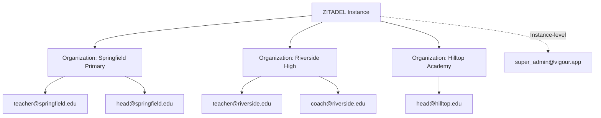
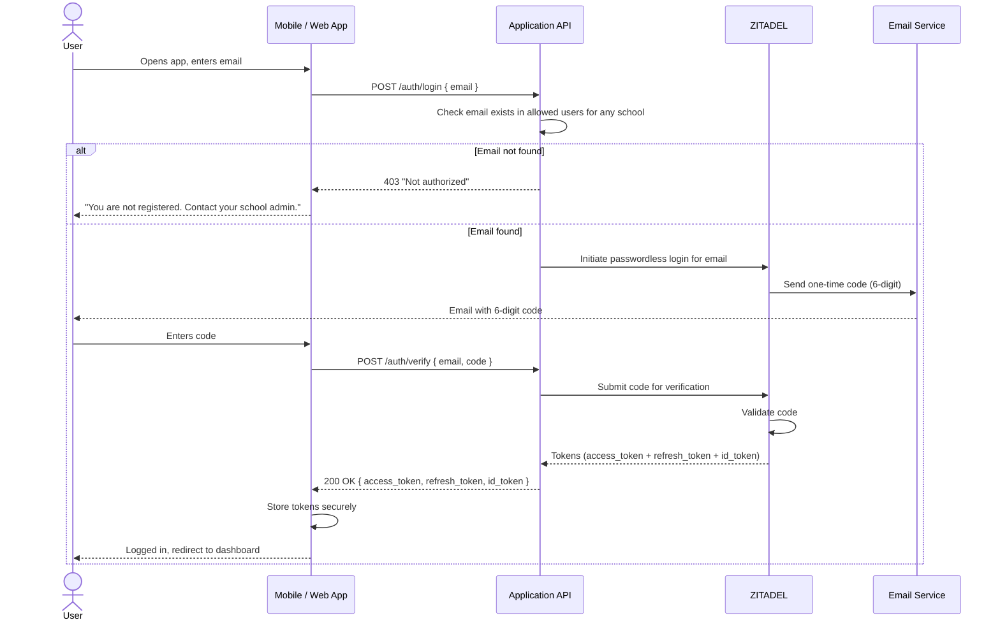
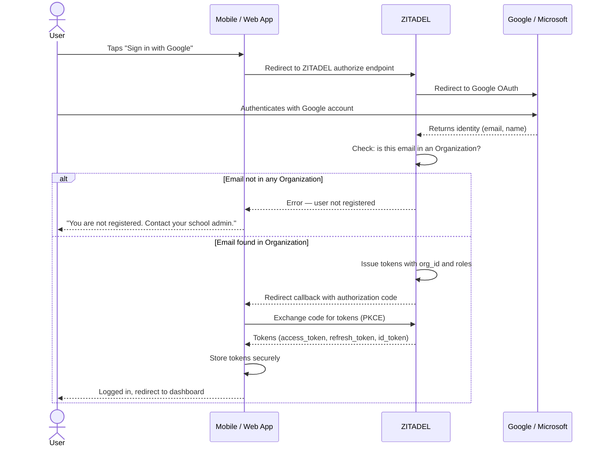
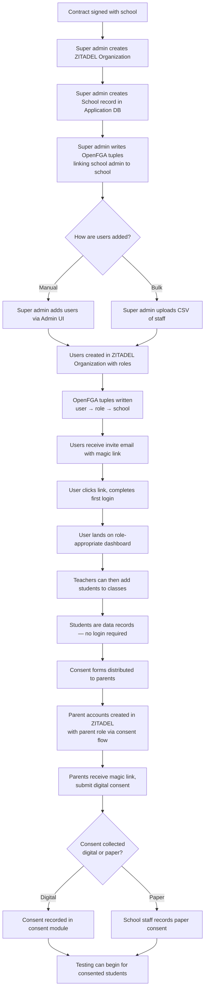

# Authentication

## 1. Overview

Authentication is handled by **ZITADEL**, an open-source OIDC provider (self-hosted or ZITADEL Cloud — see [07-infrastructure.md](./07-infrastructure.md) for the deployment decision). The platform uses **contract-based onboarding** — there is no self-signup. Schools are provisioned by a Vigour super admin after a contract is signed, and users are pre-approved per school. No one can create an account independently.

Users authenticate via one of two methods:

- **Magic link / email code** — default for all users. The Application API initiates the ZITADEL passwordless flow on the user's behalf; clients do not talk to ZITADEL directly for this method.
- **OIDC SSO** (Google Workspace / Microsoft 365) — for schools that use these identity providers. Clients redirect to ZITADEL, which federates to the external IDP. **SSO is deferred for MVP** — implement when the first SSO-requiring school is onboarded. Magic link is the MVP default for all roles.

> **Students are not users.** Students do not have accounts and do not log in. They are data records managed by teachers. See [01-domain-model.md](./01-domain-model.md) for the student entity model. If a Learner App is introduced in a future phase, a separate student authentication model would be required.

---

## 2. ZITADEL Multi-Tenant Model

ZITADEL Organizations map directly to schools, providing tenant isolation at the identity layer.



| Concept | Mapping |
|---|---|
| ZITADEL Instance | Vigour platform (single instance) |
| ZITADEL Organization | One school |
| ZITADEL User (within org) | A school-scoped person (teacher, school_head, coach) |
| Instance-level User | `super_admin` — not tied to any school, cross-org visibility |

- Each school is represented by exactly one ZITADEL Organization.
- School-scoped users (`teacher`, `coach`, `school_head`) belong to a single organization (their school).
- Organization boundaries provide tenant isolation — users in one org cannot see users or data in another.
- `super_admin` users exist at the instance level, above all organizations, with cross-org visibility.

---

## 3. User Roles

Roles match the `User.role` field in the domain model (see [01-domain-model.md](./01-domain-model.md)).

| Role | Scope | ZITADEL Level | Description |
|---|---|---|---|
| `super_admin` | Platform | Instance | Vigour platform admin. Can create schools, manage all users. Not tied to a school. |
| `school_head` | School | Organization | School principal/admin. Can view all data for their school, manage teachers, view dashboards. |
| `teacher` | School | Organization | Can create test sessions, record video, review results, manage students in their classes. |
| `coach` | School | Organization | Can view class results, leaderboards, export data. Read-only access to results. |
| `parent` | School | Organization | Parent/guardian of enrolled students. Registers via consent distribution flow (not admin-created). Authenticates via magic link only — no SSO. Can submit digital consent for their children, exercise DSAR/withdrawal rights, and optionally view their child's results if REPORTING consent is active. |

> **Note on terminology**: The role is `school_head` throughout the system (domain model, JWT claims, OpenFGA). In the OpenFGA authorization model ([04-authorization.md](./04-authorization.md)), this maps to the `school_head` relation on the `school` type.

---

## 4. Login Flows

### A) Magic Link / Email Code Flow

For magic link login, the **Application API mediates the entire flow** — the client sends the user's email to the Application API, which initiates the ZITADEL passwordless flow and handles code verification. The client never communicates with ZITADEL directly.



### B) Parent / Guardian Magic Link Flow

Parents are not provisioned by a super admin like school staff. Instead, they enter the system through the **consent distribution flow**: when a school distributes consent forms for a class, parent email addresses are collected and ZITADEL accounts are created automatically within the school's Organization with the `parent` role. Parents authenticate exclusively via magic link — SSO is not available for this role.

The magic link flow is identical to Flow A above, with these differences:

- The parent account is created as part of consent distribution, not admin onboarding.
- Parents can only access: (a) consent submission/management for their children, (b) their child's results if REPORTING consent is active, and (c) DSAR/withdrawal actions.
- Parents cannot access any school administration, class management, or testing features.

### C) OIDC / SSO Flow (Google / Microsoft)

> **MVP Note:** SSO is designed but **deferred for MVP**. Implement when the first SSO-requiring school is onboarded. Magic link is the MVP default for all roles.

For SSO login, the **client redirects directly to ZITADEL**, which federates to the external identity provider. This is a standard OIDC authorization code flow with PKCE.



---

## 5. Token Structure

The JWT issued by ZITADEL contains the following claims, which the Application API extracts in its auth middleware (see [02-api-architecture.md](./02-api-architecture.md)):

```json
{
  "sub": "user-uuid-1234",
  "email": "jane.doe@springfield.edu",
  "org_id": "org-uuid-5678",
  "roles": ["teacher"],
  "iss": "https://auth.vigour.app",
  "aud": "vigour-client-id",
  "exp": 1700000000,
  "iat": 1699999100
}
```

| Claim | Description | Used By |
|---|---|---|
| `sub` | User UUID (stable identifier, maps to `User.zitadel_id` in the domain model) | Auth middleware, OpenFGA checks |
| `email` | User email address | Display, audit logging |
| `org_id` | ZITADEL Organization ID — maps to a school's `School.id` in the application DB | Tenant scoping on every query |
| `roles` | Array of roles assigned to the user (e.g. `["teacher"]`, `["school_head"]`) | Route-level role checks, OpenFGA |
| `iss` | ZITADEL issuer URL | JWT signature validation |
| `aud` | Client/application ID | JWT audience validation |
| `exp` | Token expiry — short-lived for access tokens (15 min) | Middleware rejects expired tokens |
| `iat` | Issued-at timestamp | Token freshness checks |

The Application API validates the JWT on every request, extracting `sub`, `org_id`, and `roles` to build the user context that route handlers use for OpenFGA permission checks. See the middleware chain in [02-api-architecture.md](./02-api-architecture.md).

> **Note for instance-level users**: For `super_admin` users (who are not in a school org), `org_id` will be null or set to a platform-level value. The Application API must handle this case — these users are not scoped to a single school.

---

## 6. Onboarding Flow

All user provisioning is admin-driven. There is no self-signup, no public registration page, and no way to create an account without being pre-approved.



Key points:

- **No self-signup** for school staff. Every staff user is provisioned by a super admin after a school contract is signed.
- **Parents register via the consent distribution flow**, not through admin provisioning. When consent forms are distributed for a class, parent ZITADEL accounts are created automatically.
- **Students are not users** in the authentication system. They are data records managed by teachers. See [01-domain-model.md](./01-domain-model.md).
- **Consent is a prerequisite for testing.** After students are enrolled in classes, consent forms must be distributed to parents and consent collected (digitally or on paper) before any testing activity can begin.
- The invite email contains a magic link that bootstraps the user's first session.
- Bulk import accepts a CSV with columns: `name`, `email`, `role`.
- Each user creation triggers both a ZITADEL user record (for authentication) and an OpenFGA tuple write (for authorization). These must be kept in sync.

---

## 7. Session Management

| Concern | Approach |
|---|---|
| Access token lifetime | 15 minutes |
| Refresh token lifetime | 7 days |
| Mobile token storage | `expo-secure-store` (encrypted keychain) — see [05-client-applications.md](./05-client-applications.md) |
| Web token storage | `httpOnly` secure cookies |
| Silent refresh (mobile) | Background refresh before access token expires |
| Silent refresh (web) | `POST /auth/refresh` endpoint, returns new cookie |
| Logout | Revoke refresh token with ZITADEL, clear local storage/cookies |
| Multi-device | Refresh tokens are per-device; revoking one does not affect others |

---

## 8. Security Considerations

- **HTTPS everywhere** — all traffic between client, API, and ZITADEL is encrypted in transit.
- **Magic link codes** expire in 5 minutes and are single-use.
- **No passwords** are stored anywhere in the system. Authentication is either code-based (magic link) or delegated to an external IDP (Google/Microsoft SSO).
- **Contract-based access** — no public registration. Every user is pre-approved by an admin before they can authenticate.
- **POPIA compliance** — student data (minors) is never exposed to unauthenticated requests. All API endpoints except `/auth/*` and `/health` require a valid JWT.
- **Rate limiting** — login attempts are rate-limited to prevent brute-force attacks on email codes.
- **Token validation** — the Application API validates JWT signature, expiry, and issuer on every request via its auth middleware.
- **Org-scoped queries** — the `org_id` from the JWT is injected into every database query to prevent cross-tenant data leakage.

---

## 9. Consent as a Separate Concern

Authentication (ZITADEL) and authorization (OpenFGA) confirm that a user **is who they claim to be** and **has the role-based right to access a resource**. However, for operations involving student data, being authenticated and authorized is **necessary but not sufficient**.

**Consent status must also be verified.** The consent module (Layer 3 — see the data privacy decisions and consent module documentation) tracks whether a parent/guardian has granted consent for specific data processing activities (e.g., METRIC_PROCESSING, REPORTING). Before returning student data, the Application API must check both:

1. **OpenFGA**: Does this user have a relationship that grants access? (e.g., teacher of the class)
2. **Consent module**: Has the required consent been granted for this student? (e.g., METRIC_PROCESSING consent is active)

If either check fails, the data must not be returned. These are complementary systems — OpenFGA handles relationship-based access control, the consent module handles consent-based data processing rights. See [04-authorization.md](./04-authorization.md) for more detail on the consent-authorization boundary.

---

## 10. Open Questions

| # | Question | Notes | Status |
|---|---|---|---|
| 1 | Self-hosted ZITADEL or ZITADEL Cloud for initial deployment? | Cloud reduces ops burden for MVP; self-hosted gives full control and data residency. Also tracked in [07-infrastructure.md](./07-infrastructure.md). | Open |
| 2 | Do we need MFA for `school_head` role? | This role accesses sensitive aggregate data. MFA adds friction but reduces risk. | Open |
| 3 | How do we handle teacher transfers between schools? | Move user to new ZITADEL Organization and update OpenFGA tuples? Or deactivate and re-create? | Open |
| 4 | What happens when a school's contract expires? | Soft-disable (read-only, no new sessions) vs. hard-delete (data removal after grace period). Affects ZITADEL org status and OpenFGA tuples. | Open |
| 5 | How does `org_id` work for instance-level users (`super_admin`)? | These users are not in a school org. Need to define what `org_id` claim contains for them and how the API middleware handles it. | Open |
