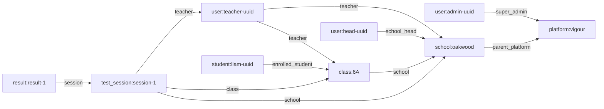
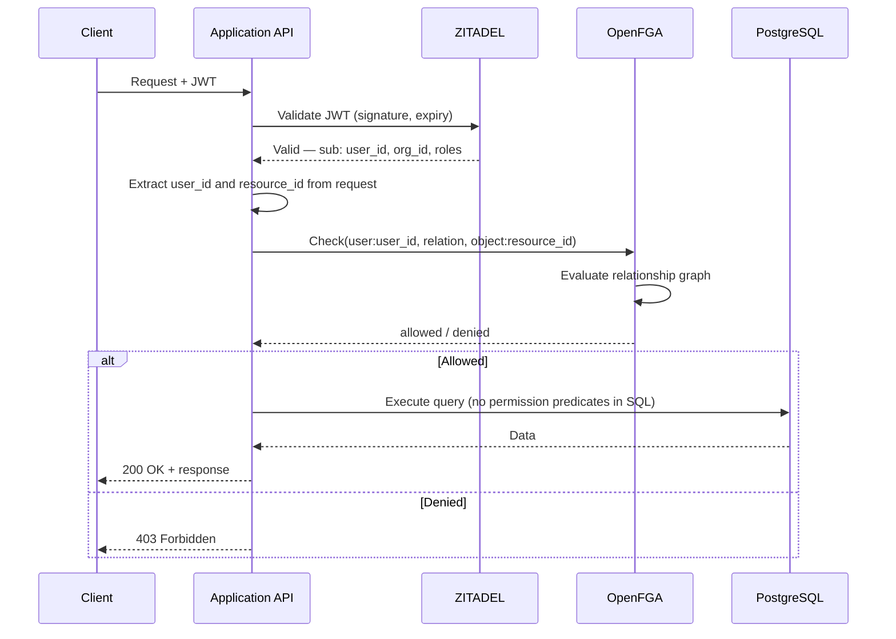
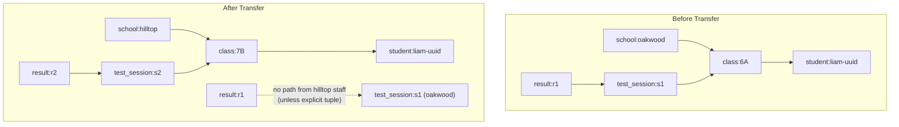

# Authorization

## Overview

Authorization is handled by **OpenFGA**, a relationship-based access control system built on Google's Zanzibar model. It runs as a separate service alongside the Application API and PostgreSQL.

The Application API checks OpenFGA on every request to determine whether the authenticated user can perform the requested action on the requested resource. The division of responsibility is clear:

- **PostgreSQL** stores facts (data) — schools, classes, students, results
- **OpenFGA** guards access (permissions) — who can see or do what, and why

No permission logic lives in SQL. No data lives in OpenFGA. Each system does one job.

**No row-level security in Postgres.** Authorization lives entirely in the application layer. The Application API asks OpenFGA "can this user do this?", gets a yes/no, then runs a clean SQL query with no permission predicates. This is a deliberate architectural decision — see [00-system-overview.md](./00-system-overview.md).

## Why OpenFGA over Postgres RLS

Row-Level Security was considered and rejected. The reasons:

- **Complexity** — Multi-tenant school hierarchies (school > class > student > session > result) make RLS policies deeply nested, hard to test, and brittle when the model evolves.
- **Relationship changes are first-class** — A student transferring schools or a teacher being reassigned is a simple tuple write/delete in OpenFGA. With RLS, it means reworking policy conditions or maintaining shadow tables.
- **SQL stays simple** — Queries don't carry permission predicates. The Application API asks OpenFGA "can this user do this?", gets a yes/no, then runs a clean query.
- **Auditability** — OpenFGA can log who has access to what and why, with a clear graph of relationships to inspect.
- **Future flexibility** — Schools could potentially define custom permission rules without code changes, just tuple configuration.

## Authorization Model

The OpenFGA type definitions that model Vigour's permission structure. Types correspond to domain entities defined in [01-domain-model.md](./01-domain-model.md). Roles match those defined in [03-authentication.md](./03-authentication.md): `super_admin`, `school_head`, `teacher`, `coach`, `parent`.

```dsl
model
  schema 1.1

type user

type student
  relations
    define guardian: [user]

type platform
  relations
    define super_admin: [user]

// Parents are associated with schools via ZITADEL Organizations but are not school
// members in the OpenFGA model. Their access path is:
// parent (user) → guardian of student → student's results.
type school
  relations
    define parent_platform: [platform]
    define school_head: [user]
    define teacher: [user]
    define coach: [user]
    define member: school_head or teacher or coach
  permissions
    define can_view: member or super_admin from parent_platform
    define can_manage: school_head or super_admin from parent_platform

type class
  relations
    define school: [school]
    define teacher: [user]
    define enrolled_student: [student]
  permissions
    define can_view: teacher or school_head from school or coach from school
    define can_edit: teacher or school_head from school

type test_session
  relations
    define school: [school]
    define class: [class]
    define teacher: [user]
  permissions
    define can_view: teacher or teacher from class or school_head from school or coach from school
    define can_manage: teacher or school_head from school
    define can_approve_results: teacher or school_head from school

type result
  relations
    define session: [test_session]
    define tested_student: [student]
  permissions
    define can_view: can_view from session or guardian from tested_student
    define can_approve: can_approve_results from session

```

> **Note on `type student` vs `type user`**: Students are **not** users in the authentication system (see [01-domain-model.md](./01-domain-model.md) and [03-authentication.md](./03-authentication.md)). The `student` type in OpenFGA represents student data records, not authenticated accounts. Students never perform permission checks themselves -- they are objects that users (teachers, coaches, school heads, parents) access through class, school, or guardian relationships. The `user` type represents authenticated actors (teachers, coaches, school heads, parents, super admins).

> **Note on parent access to results**: A parent with a `guardian` relation to a student can view that student's results via the `guardian from tested_student` path on the `result` type. However, OpenFGA access alone is not sufficient — the Application API must also verify that the student has active REPORTING consent before returning results to a parent. See the Consent-Authorization Boundary section below.

### Types Not Modelled Separately

The following domain entities from [01-domain-model.md](./01-domain-model.md) do not have their own OpenFGA types. Access to them is derived from their parent entity's permissions:

| Domain Entity | Authorization Via | Rationale |
|---|---|---|
| **BibAssignment** | `test_session` — `can_manage` | Bib assignments are always created/read in the context of a test session. If a user can manage the session, they can manage its bib assignments. |
| **Clip** | `test_session` — `can_manage` / `can_view` | Clips belong to a session. Viewing or managing clips requires session-level access. |
| **Student Results** | `class` or `school` — `can_view` | Test results are read in the context of a student profile, class dashboard, or school dashboard. The viewer's relationship to the class or school gates access. |
| **ClassStudent** | `class` — `can_edit` | The join table between classes and students. Editing class membership requires `can_edit` on the class. |

> **Note on student data operations**: Student profile management (adding, editing, removing students from classes) is covered by `class.can_edit`. Consent management for students is handled by the consent module with its own access controls — `school_head` or `parent` (guardian) can manage consent. Consent management is not an OpenFGA concern; it is enforced at the application layer.

## Relationship Examples

Concrete tuples that would exist for a teacher at Oakwood Primary:

| Tuple | Meaning |
|---|---|
| `user:teacher-uuid` is `teacher` of `school:oakwood` | Teacher belongs to the school |
| `user:teacher-uuid` is `teacher` of `class:6A` | Teacher is assigned to class 6A |
| `class:6A` has `school` `school:oakwood` | Class belongs to the school |
| `user:head-uuid` is `school_head` of `school:oakwood` | School head manages the school |
| `user:coach-uuid` is `coach` of `school:oakwood` | Coach is attached to the school |
| `student:liam-uuid` is `enrolled_student` of `class:6A` | Liam is enrolled in class 6A |
| `test_session:session-1` has `class` `class:6A` | Session was run for class 6A |
| `test_session:session-1` has `teacher` `user:teacher-uuid` | Teacher owns this session |
| `test_session:session-1` has `school` `school:oakwood` | Session belongs to school |
| `result:result-1` has `session` `test_session:session-1` | Result belongs to this session |
| `school:oakwood` has `parent_platform` `platform:vigour` | School linked to platform (for super_admin traversal) |
| `user:admin-uuid` is `super_admin` of `platform:vigour` | Super admin has platform-wide access |
| `user:parent-uuid` is `guardian` of `student:liam-uuid` | Parent is guardian of student Liam |

The relationship graph that OpenFGA traverses:



**Example check**: Can `teacher-uuid` view `result-1`?

OpenFGA traverses: `result:result-1` -> `can_view` -> `can_view from session` -> `test_session:session-1` -> `can_view` -> `teacher` -> matches `user:teacher-uuid` -- **allowed**.

**Example check**: Can `head-uuid` approve `result-1`?

OpenFGA traverses: `result:result-1` -> `can_approve` -> `can_approve_results from session` -> `test_session:session-1` -> `can_approve_results` -> `school_head from school` -> `school:oakwood` -> `school_head` -> matches `user:head-uuid` -- **allowed**.

## Permission Check Flow

Every API request goes through this sequence. This aligns with the request flow described in [02-api-architecture.md](./02-api-architecture.md) -- JWT validation happens first (via ZITADEL), then OpenFGA is checked before any database query.



The Application API never queries data before confirming permission. OpenFGA checks are fast (sub-millisecond for cached evaluations) and happen before any database call.

## Consent-Authorization Boundary

OpenFGA and the consent module are **complementary, not overlapping**. They answer different questions:

| System | Question It Answers | Basis |
|---|---|---|
| **OpenFGA** | "Is this user allowed to access this resource?" | Relationship-based (role, school, class membership) |
| **Consent module** (Layer 3) | "Has consent been granted for this data to be processed?" | Consent-based (parent/guardian grant, POPIA compliance) |

**Both checks are required** for any operation involving student data. Being authorized by OpenFGA is necessary but not sufficient.

Consent checking is **not** an OpenFGA concern — it happens at the application layer alongside the OpenFGA check. The Application API is responsible for combining both results:

1. **OpenFGA check**: Does the user have a relationship that permits access? (e.g., teacher of the class, guardian of the student)
2. **Consent check**: Has the required consent type been granted for this student? (e.g., METRIC_PROCESSING, REPORTING)

If either check fails, the operation is denied or the specific student's data is excluded from the response.

**Example**: A teacher has OpenFGA access to class 6A's results (via `teacher` relation on the class). When loading results for class 6A, the Application API:
1. Confirms OpenFGA access (teacher can view class 6A results) — **allowed**
2. Queries the consent module for each student in 6A
3. If student Liam's METRIC_PROCESSING consent has been withdrawn, Liam's results are **excluded** from the response, even though the teacher has OpenFGA access to them

This separation keeps OpenFGA focused on structural access control and keeps consent logic in the consent module where it can enforce POPIA-specific rules (withdrawal, expiry, re-consent). See [03-authentication.md](./03-authentication.md) Section 9 for the authentication-layer perspective on this boundary.

## Result Approval Permissions

Result approval is a key workflow described in [06-data-flow.md](./06-data-flow.md). The authorization rules are:

- **Teachers** can approve results for sessions they own (direct `teacher` relation on the `test_session`).
- **School heads** can approve results for any session at their school (via `school_head from school` on the `test_session`).
- **Coaches** can view results but cannot approve them.
- **Super admins** do not directly approve results -- approval is a school-level action.

The `can_approve_results` permission on `test_session` gates result approval. The `can_approve` permission on `result` delegates to the session's `can_approve_results`, keeping the permission definition in one place.

## Relationship Lifecycle

Tuples are written and deleted at specific domain events:

| Event | Tuple Operations |
|---|---|
| **Platform bootstrapped** | `write(platform:vigour)` — singleton |
| **Super admin created** | `write(user:admin-uuid, super_admin, platform:vigour)` |
| **School onboarded** | `write(school:X, parent_platform, platform:vigour)` |
| **School head added** | `write(user:head-uuid, school_head, school:X)` |
| **Teacher added to school** | `write(user:teacher-uuid, teacher, school:X)` |
| **Coach added to school** | `write(user:coach-uuid, coach, school:X)` |
| **Teacher assigned to class** | `write(user:teacher-uuid, teacher, class:Y)` |
| **Class created** | `write(class:Y, school, school:X)` |
| **Student enrolled in class** | `write(student:student-uuid, enrolled_student, class:Y)` |
| **Consent distributed to parent** | `write(user:parent-uuid, guardian, student:student-uuid)` — parent account created in ZITADEL and guardian tuple written |
| **Test session created** | `write(test_session:T, class, class:Y)` + `write(test_session:T, school, school:X)` + `write(user:teacher-uuid, teacher, test_session:T)` |
| **Student transfers school** | Delete old school/class tuples, write new ones (see below) |
| **Teacher leaves school** | Delete all tuples for that user-school pair and their class/session assignments |

## Student Transfer Scenario

When a student moves from School A to School B, the following happens. This is consistent with the "students own their results" principle from [01-domain-model.md](./01-domain-model.md) and the data flow described in [06-data-flow.md](./06-data-flow.md).

**In the Application DB:**
- The `Student` record's `school_id` is updated from School A to School B.
- All existing `Result` records remain linked to the student's UUID -- nothing is deleted.

**In OpenFGA:**
- Delete: `student:student-uuid` is `enrolled_student` of `class:old-class` (School A class)
- Write: `student:student-uuid` is `enrolled_student` of `class:new-class` (School B class)

**Effect on access:**
- School A staff lose access to the student because the relationship path from School A through classes to the student is broken. There is no tuple connecting School A's classes to this student anymore.
- School B staff gain access to new results created under new class/school tuples.
- Historical results (created at School A) remain linked to the student by `student_id` on the `Result` record, but School B cannot view them by default because those results belong to sessions at School A.
- Historical results **could optionally be shared** with School B by writing an explicit tuple granting access.



The student UUID is the anchor. Permissions flow through school/class relationships, but the data link (result -> student) is permanent.

## Super Admin Access

Super admins (`super_admin` on `platform:vigour`) have platform-wide access for administrative operations:

- Onboarding new schools
- Managing users across all schools
- Viewing platform-level metrics and health

Super admin access is checked by traversing from the target school to `platform:vigour` and checking the `super_admin` relation. This avoids writing a tuple per school for each super admin -- a single `super_admin` tuple on the platform grants access to all schools.

## Open Questions

- **Contextual tuples for temporary access** -- Should we use OpenFGA's contextual tuples for substitute teachers or short-term access grants? These are tuples that exist only for the duration of a check, not persisted.
- **Bulk permission checks** -- When loading a class of 30 students, do we make 30 individual checks or use OpenFGA's `ListObjects` to get all permitted resources in one call? Performance implications need benchmarking.

## Resolved Decisions

- **Audit log of permission changes** -- **Yes, required for POPIA compliance.** The Application API logs all OpenFGA tuple writes and deletes as part of the compliance audit trail. This is application-layer logging (not OpenFGA-internal) — every tuple mutation is recorded with timestamp, actor, and the tuple that was written or deleted. This is sufficient for POPIA audit requirements without adding complexity inside OpenFGA itself.
- **SpiceDB vs OpenFGA** -- **Decision: OpenFGA.** Ecosystem alignment with ZITADEL, better tooling (Playground, VS Code extension, migration tooling), Auth0/Okta backing, and the existing documentation all favor OpenFGA. SpiceDB's stronger consistency model is not required for Vigour's access patterns.
- **District-level access** -- The `district` type in OpenFGA is **deferred to Phase 2+**. Phase 1 operates at class and school level only, per the research decisions. District-level aggregation and cross-school access will be modelled when multi-school management is required.
