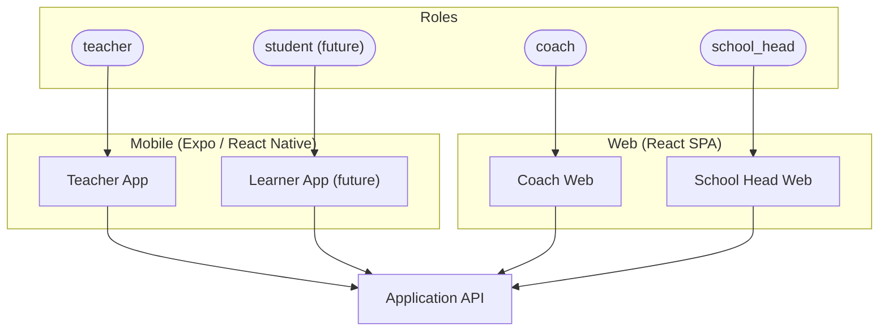
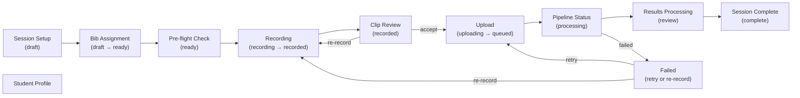
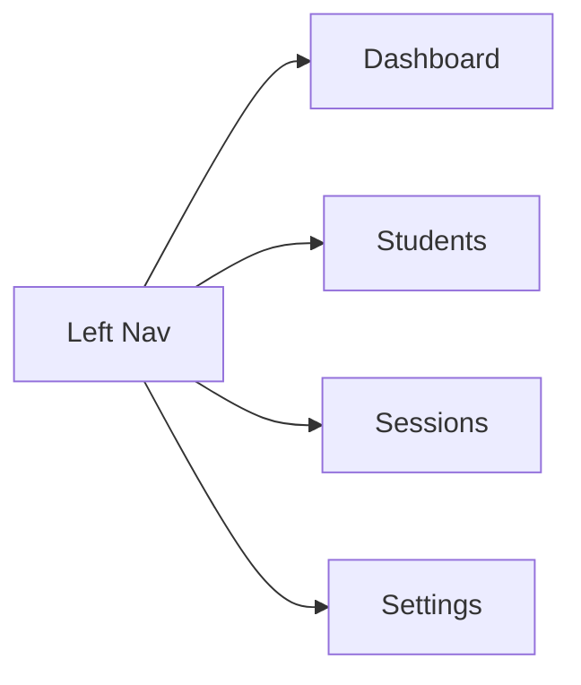

# Client Applications

## 1. Overview

The Vigour platform has **6 user-facing surfaces** across **2 form factors** (mobile native, web). All clients talk exclusively to the **Application API**. They never interact with the Pipeline API or OpenFGA directly. Authentication is handled via ZITADEL OIDC — mobile clients use `expo-auth-session` (PKCE flow), web clients use `react-oidc-context`. JWT tokens are attached to every API request.

| Form Factor | Clients | Auth Library |
|---|---|---|
| Mobile (Expo / React Native) | Teacher App, Learner App (future) | `expo-auth-session` + ZITADEL OIDC (PKCE), tokens in `expo-secure-store` |
| Web (React SPA) | Coach Dashboard, School Head Dashboard | `react-oidc-context` + ZITADEL OIDC, tokens in `httpOnly` secure cookies |

### Role-to-Client Mapping

| Role | Client | Permissions Summary |
|---|---|---|
| `teacher` | Teacher App (mobile) | Create sessions, record video, assign bibs, review/approve results, manage students in their classes |
| `coach` | Coach Web | Read-only access to class results, leaderboards, export data. See [04-authorization.md](./04-authorization.md) |
| `school_head` | School Head Web | View all data for their school, manage teachers, view dashboards. Maps to `admin` in OpenFGA model |
| `student` *(future)* | Learner App (mobile) | View own results only |
| `super_admin` | Admin UI *(not covered here)* | Platform-level administration: onboard schools, manage users. Operates via `/admin/*` API routes |

---

## 2. Application Map

---

## 3. Teacher App (Mobile)

The primary operational tool. Teachers use this app to set up sessions, assign bibs to students, record video, upload to cloud storage, and review CV-processed results.

**Tech stack**: Expo / React Native (iOS + Android)

**Auth**: `expo-auth-session` + ZITADEL OIDC (PKCE flow), tokens stored in `expo-secure-store`. See [03-authentication.md](./03-authentication.md) for login flow details.

### Key Screens and Session Lifecycle

Each screen maps to one or more session lifecycle states defined in [06-data-flow.md](./06-data-flow.md).

| Screen | Session State | Description |
|---|---|---|
| **Session Setup** | `draft` | Select class (grade implied) and test type. Creates a `TestSession` record in `draft` state. Works offline with cached class lists. |
| **Bib Assignment** | `draft` -> `ready` | Assign bib numbers (1-30) to students for this session. Creates `BibAssignment` records linking `session_id` + `student_id` + `bib_number`. This is the critical bridge between the CV pipeline (which only knows bibs) and student identity. Transitions session to `ready` when all bibs are assigned. Works offline. See [01-domain-model.md](./01-domain-model.md) for the bib assignment workflow. |
| **Pre-flight Check** | `ready` | Live camera preview with CV pre-check: verifies cones are visible, students are in frame, bib numbers are readable, lighting is adequate. |
| **Recording** | `recording` -> `recorded` | Camera capture at 60fps / 4K with live overlay (bib detection count, tracking indicators). Transitions to `recorded` when capture completes. |
| **Clip Review** | `recorded` | Playback recorded clip with a CV quality summary. Teacher decides to re-record (back to `recording`) or accept and upload. |
| **Upload** | `uploading` -> `queued` | Follows the resolved **Option B upload flow**: (1) app calls `POST /sessions/{id}/clips` to create a Clip record and receive a `clip_id` + signed GCS upload URL in one response, (2) app uploads video directly to GCS via the signed URL (no video bytes through the API), (3) app calls `PATCH /sessions/{id}/clips/{clip_id}` to confirm upload, which triggers pipeline job submission. Progress indicator shown during upload. See [02-api-architecture.md](./02-api-architecture.md) for the full sequence. |
| **Pipeline Status** | `queued` -> `processing` | Displays stage-by-stage progress while the CV pipeline processes (Ingest -> Detect -> Track -> Pose -> OCR -> Calibrate -> Extract -> Output). If pipeline fails, session moves to `failed` state — teacher can retry (re-queue) or re-record. MVP uses polling; future enhancement may use WebSocket. See [08-pipeline-integration.md](./08-pipeline-integration.md). |
| **Results Processing** | `review` | Teacher reviews per-student results matched via `BibAssignment`. For each result: approve correct matches, reject and manually reassign mismatched bibs (e.g. OCR misread "7" as "1"), flag suspicious results. **Bulk approve**: "Approve All High Confidence" button bulk-approves results with `confidence_score > 0.8`. **Commit to Profiles**: once review is complete, teacher commits approved results to student profiles. See [06-data-flow.md](./06-data-flow.md) for the full approval flow. |
| **Session Complete** | `complete` | Final ranked results list. Session is complete and results are permanently linked to student profiles. |
| **Student Profile** | N/A | Individual student history across all tests and terms. Displays per-test results (explosiveness, speed, fitness, agility, balance) with raw metrics and trends. See [01-domain-model.md](./01-domain-model.md). |

### Offline Considerations

Per [00-system-overview.md](./00-system-overview.md), the Teacher App supports offline operation for session preparation:

- **Session Setup** and **Bib Assignment** work offline using cached class lists and student rosters.
- Video recording works offline (stored locally on device).
- **Video upload** is queued locally and executes when connectivity returns. The upload queue persists across app restarts.
- **Results viewing**, **Pipeline Status**, and **Results Processing** require connectivity.

### Camera Integration

- Uses `expo-camera` for recording.
- Pre-flight CV checks may require a lightweight on-device model or basic frame analysis from the camera preview. Whether this runs on-device or streams frames to the API is an open question.

---

## 4. Learner App (Mobile)

**Status**: Future phase. Blocked on student authentication model decision.

**Tech stack**: Expo / React Native

**Auth**: Student accounts (implementation TBD — see [03-authentication.md](./03-authentication.md), open question on student authentication model)

### Key Screens

| Screen | Description |
|---|---|
| **Dashboard** | Personal test results for all 5 tests with raw metrics, trend vs last term, improvement tips |
| **Class Board** | Anonymised class ranking or comparison |
| **Exercise Tips** | Recommendations based on weakest test area |

> **Note**: Students are currently not users in the system (see [01-domain-model.md](./01-domain-model.md)). This app requires a decision on student authentication — parent-managed accounts? School-issued codes? This is a product decision that blocks development. See [00-system-overview.md](./00-system-overview.md) open question #6.

---

## 5. Coach Web Dashboard

Desktop analytics for coaches who need to review class performance. Coaches have **read-only** access to results — they cannot approve, reject, or modify results (that is a teacher action).

**Tech stack**: React SPA (Vite or Next.js)

**Auth**: `react-oidc-context` + ZITADEL OIDC, tokens in `httpOnly` secure cookies. See [03-authentication.md](./03-authentication.md).

### Key Screens

| Screen | Description |
|---|---|
| **Class Leaderboard** | Sortable table — student name, bib, test results, attendance, change vs last term. Results are raw metrics from individual tests. |
| **Student Detail** | Individual student's per-test breakdown: explosiveness, speed, fitness, agility, balance scores. Historical trend across terms. |
| **Participation Tracking** | Attendance and completion rates per session |
| **CSV Export** | Export raw class data |

### Navigation

---

## 6. School Head Web Dashboard

School-wide overview for principals and administrators. The `school_head` role maps to `admin` in the OpenFGA model, granting view access to all classes and students within their school. See [04-authorization.md](./04-authorization.md).

**Tech stack**: React SPA (shared codebase with Coach Web, different role/views)

**Auth**: `react-oidc-context` + ZITADEL OIDC, tokens in `httpOnly` secure cookies. See [03-authentication.md](./03-authentication.md).

### Key Screens

| Screen | Description |
|---|---|
| **School Overview** | Total students, school-wide performance summary, participation %, improvement % vs last term, at-risk student count |
| **Grade Breakdown** | Per-grade performance data and trends across terms |
| **Participation by Grade** | Grade-level attendance and completion rates |
| **At-Risk Alerts** | Students flagged as declining over 2+ sessions. At-risk is driven by test result trends. See [01-domain-model.md](./01-domain-model.md) open question on at-risk granularity. |
| **Average Score by Test** | Bar chart of average scores across the 5 test types (Vertical Jump, 5m Sprint, Shuttle Run, Cone Drill, Single-Leg Balance) for all grades |

---

## 7. Shared Infrastructure

### Shared UI Kit

Common design system across all web dashboards (Coach Web, School Head Web):

- Colour palette and typography
- Component library (tables, cards, charts, forms)
- Chart components with consistent styling

### API Client

Auto-generated **TypeScript client** from the OpenAPI spec, shared across all clients (mobile and web). This ensures type safety and keeps clients in sync with API changes.

### State Management

**React Query / TanStack Query** for server state:

- Caching and background refetch
- Polling (pipeline status updates on the Teacher App's Pipeline Status screen)
- Optimistic updates (approve/reject results on the Results Processing screen)
- Offline mutation queue (Teacher App — session setup, bib assignment, upload queue)

---

## 8. Open Questions

| Question | Options | Impact |
|---|---|---|
| Monorepo or separate repos? | Turborepo/Nx monorepo vs separate repos per client | Developer workflow, CI/CD, shared code |
| Coach Web + School Head Web: shared codebase? | Single app with role-based views vs separate apps | Code reuse, complexity, deploy independence |
| Charting library? | recharts, nivo, victory | Bundle size, customisation, React compatibility |
| Pre-flight CV check: on-device or API? | Lightweight on-device model vs stream frames to API | Latency, offline capability, device requirements |
| At-risk flagging granularity? | Overall result trends vs per-test flagging | Per-test is more actionable; overall is simpler. See [01-domain-model.md](./01-domain-model.md). |

### Resolved (Previously Open)

| Question | Resolution | Reference |
|---|---|---|
| Teacher App: offline-first or online-required? | Online-required with offline queue for session setup, bib assignment, and video upload. Results viewing requires connectivity. | [00-system-overview.md](./00-system-overview.md) cross-cutting concerns |
| Student authentication model? | Deferred to future phase. Blocks Learner App development. | [00-system-overview.md](./00-system-overview.md) open question #6 |
