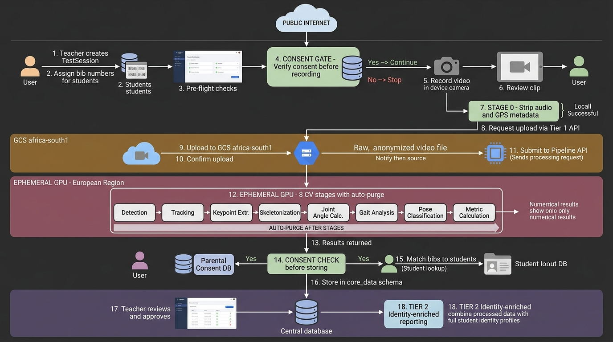
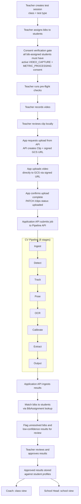
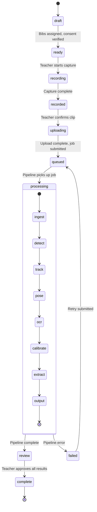
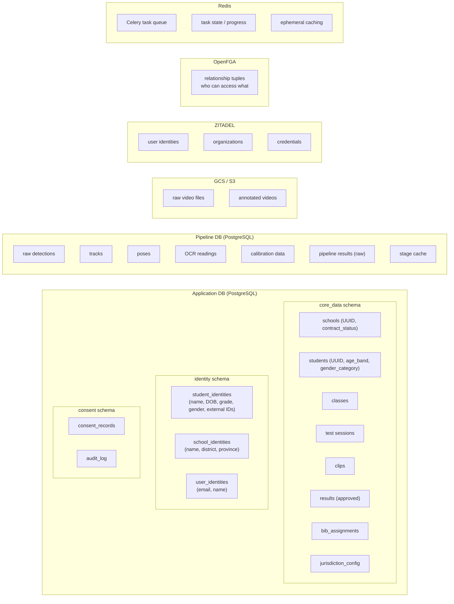
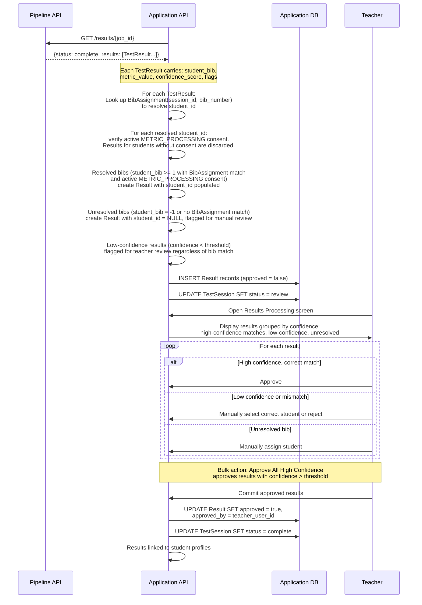
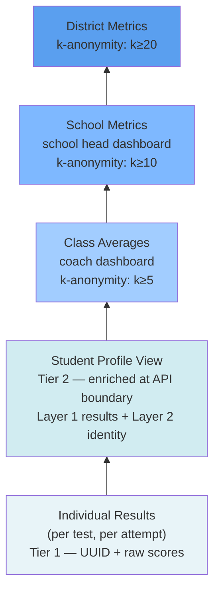
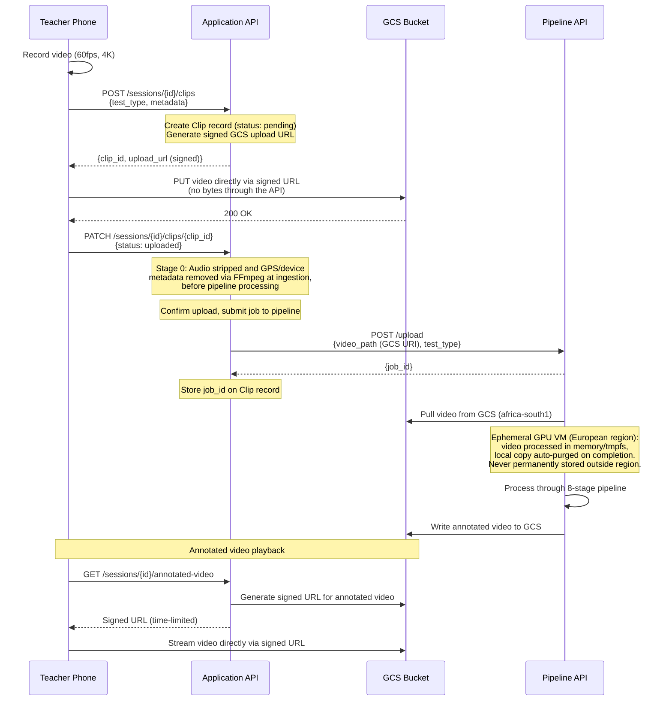

# Data Flow

## 1. Overview

This document traces how data moves through the Vigour platform end-to-end, from a teacher setting up a test session through to results appearing on dashboards. It covers the session lifecycle, data ownership boundaries, the result approval workflow, data aggregation, and video handling.

The session lifecycle state machine in Section 3 is the **canonical reference** for session states. Other documents (domain model, API architecture, client applications) should defer to this definition.

---

## 2. End-to-End Flow

The upload step follows the **resolved "task before upload" pattern (Option B)**: the Application API creates a task record (Clip) and returns a signed GCS URL in one response. The client uploads directly to cloud storage — no video bytes pass through the API. On completion, the client confirms the upload, which triggers pipeline processing.

---

## 3. Session Lifecycle States

This is the **canonical state machine** for test sessions. The `TestSession.status` field in the domain model tracks the top-level state. The `processing` state contains the 8 pipeline sub-stages (Ingest, Detect, Track, Pose, OCR, Calibrate, Extract, Output).

**State descriptions:**

| State | Description |
|-------|-------------|
| `draft` | Session created with class and test type selected. No bibs assigned yet. |
| `ready` | Bibs assigned to students. All bib-assigned students verified to have active `VIDEO_CAPTURE` + `METRIC_PROCESSING` consent. Students without consent must be removed before the session can move to `recording`. Teacher can begin recording. |
| `recording` | Teacher is actively capturing video. |
| `recorded` | Capture complete. Teacher can review the clip locally before uploading. |
| `uploading` | Video is being uploaded directly to GCS via signed URL. |
| `queued` | Upload confirmed; job submitted to Pipeline API. Waiting for a worker. |
| `processing` | Pipeline is actively processing the video through 8 stages. |
| `failed` | Pipeline encountered an error. Teacher can retry or re-record. |
| `review` | Pipeline complete. Results are matched to students and awaiting teacher approval. |
| `complete` | Teacher has approved all results. Results linked to student profiles. |

> **Note**: The domain model (`01-domain-model.md`) defines the full set of 10 states on the `TestSession` entity. This document provides the canonical state machine with transition triggers and the processing sub-states.

---

## 4. Data Ownership

The Application DB and Pipeline DB are **separate databases** (or separate schemas within a single PostgreSQL instance — see [07-infrastructure.md](./07-infrastructure.md)). Each service owns its own data. The Application API never writes to the Pipeline DB, and the Pipeline never writes to the Application DB.

**Ownership rules:**

- **Application API** owns all three schemas: `core_data` (schools, students as UUID-keyed records, classes, sessions, clips, results, bib_assignments, jurisdiction_config), `identity` (student_identities, school_identities, user_identities — Layer 2 PII), and `consent` (consent_records, audit_log).
- **Pipeline API** owns: raw detections, tracks, poses, OCR readings, calibration data, raw pipeline results, stage cache.
- **GCS** holds: raw video, annotated video (written by pipeline workers).
- **ZITADEL** owns: user identities, organizations, credentials. Application DB stores a `zitadel_id` foreign reference.
- **OpenFGA** owns: all authorization relationship tuples.
- **Redis** holds: Celery task queue, task state, pipeline stage progress, ephemeral caches. All data is transient.

---

## 5. Result Approval Flow

When the pipeline completes, results flow through a structured ingestion and approval process. This aligns with the result ingestion defined in [08-pipeline-integration.md](./08-pipeline-integration.md).

**Key details:**

- **BibAssignment** is the bridge between pipeline output (bib numbers) and application data (named students). See [01-domain-model.md](./01-domain-model.md) for the bib assignment workflow.
- **Confidence-based flagging**: The pipeline attaches a `confidence_score` (0.0-1.0) and `flags` array (e.g. `["low_confidence", "partial_occlusion"]`) to each result. Low-confidence results are flagged for manual review even if the bib resolved successfully.
- **Unresolved bibs**: When `student_bib = -1` or there is no matching `BibAssignment` for the session, the result is created with `student_id = NULL` and must be manually assigned by the teacher.
- **Rejected results** can be reassigned to a different student, discarded, or left unresolved.

---

## 6. Data Aggregation Flow

Data aggregates upward through progressive levels, with PII stripped at each boundary.

At each aggregation level:

- **Individual Results** — raw metric values per test attempt, linked to a student via approved Result records. Stored as UUID + raw scores only (Tier 1, Layer 1).
- **Student Profile View** — an enrichment operation, NOT a stored entity containing "full PII." Layer 1 results (UUIDs + scores) are enriched with Layer 2 identity (names) at the API boundary (Tier 2) for display. PII and results are never co-located in storage. Visible to teacher and parent.
- **Class Averages** — aggregated from student test results. No individual student names. Groups with fewer than 5 students are suppressed (k-anonymity threshold k≥5). Visible to coach and school head.
- **School Metrics** — school-wide averages, grade breakdowns, participation rates, at-risk counts. Groups with fewer than 10 students are suppressed (k≥10). Visible to school head.
- **District Metrics** — cross-school aggregation. Groups with fewer than 20 students are suppressed (k≥20). Visible to district administrators.

> **Scoring engine note:** Only raw scores are stored in the data layer. Categorical labels (e.g. "above average"), percentiles, and risk flags are computed in the presentation layer (client app), not stored.

---

## 7. Video Data Flow

Video upload follows the **task-before-upload pattern (Option B)**, a resolved architectural decision (see [00-system-overview.md](./00-system-overview.md)). The API creates a Clip record and returns both a clip ID and a signed GCS URL in one response. The client uploads directly to cloud storage. No video bytes pass through the Application API.

**Key points:**

- **Signed URLs only** — all GCS access (upload and download) uses time-limited signed URLs generated by the Application API. No public buckets.
- **Client confirms upload** — the client sends a PATCH to confirm the upload is complete. This triggers pipeline job submission. There is no GCS-to-API notification; the client is the source of truth for upload completion.
- **Task handle always available** — because the Clip record is created before the upload, the client always has a clip ID to track status. Orphaned uploads (started but never confirmed) are detectable and recoverable.
- **Metadata stripping (Stage 0)** — on ingestion, before pipeline processing, audio is stripped and GPS/device metadata is removed via FFmpeg. The sanitised video is what enters the pipeline.
- **Ephemeral GPU processing** — video is pulled from GCS (africa-south1) to an ephemeral GPU VM in a European region. Processing occurs in memory/tmpfs. Metrics are returned to the Application DB, and the local video copy is auto-purged on VM completion. Video is never permanently stored outside the source region.
- **Annotated video** is written to GCS by the pipeline workers and served to clients via signed URLs generated by the Application API.

---

## 8. Tier 1 / Tier 2 Boundary Annotations

Operations in the data flow are split across two API tiers:

| Operation | Tier | Data Accessed |
|-----------|------|---------------|
| Result ingestion (bib → student_id resolution) | Tier 1 | UUID-keyed records only (`core_data` schema) |
| Consent verification at recording and ingestion | Cross-cutting middleware (pre-tier) | `consent` schema (no PII) — runs before tier-specific logic |
| Pipeline submission and progress tracking | Tier 1 | Clip records, job IDs |
| Dashboard aggregation (class/school/district) | Tier 1 | Aggregated scores by UUID |
| Teacher review screen (display student names alongside results) | Tier 2 | Enriches Layer 1 UUIDs with Layer 2 student names from `identity` schema |
| Parent view (child's results with name) | Tier 2 | Enriches Layer 1 results with Layer 2 identity |
| Admin user management | Tier 2 | `identity.user_identities` |

Tier 2 enrichment happens at the API boundary — the response joins Layer 1 and Layer 2 data for display, but they remain in separate schemas in storage.

---

## 9. Consent Withdrawal Flow

When consent is withdrawn for a student, the system executes cascading actions depending on the consent type:

**VIDEO_CAPTURE withdrawn:**
- Delete all retained video (raw and annotated) in GCS for clips where the student was a bib-assigned participant.
- Automatically withdraw dependent consents: `METRIC_PROCESSING` and `MODEL_TRAINING`.
- Flag the student for exclusion from future video captures (student cannot be assigned a bib until consent is re-granted).

**METRIC_PROCESSING withdrawn:**
- Approved results linked to the student remain but are marked as `consent_withdrawn` and excluded from aggregation and dashboards.
- Future pipeline results for this student are discarded at ingestion (see consent verification gate in Section 5).

**IDENTITY_STORAGE withdrawn:**
- Delete the student's Layer 2 record (`identity.student_identities`).
- Layer 1 data (`core_data.students` UUID, age_band, gender_category, and any linked results) becomes orphaned/anonymous — it can no longer be linked to a named individual.

**ALL consent withdrawn:**
- Execute all of the above.
- Additionally, delete the Layer 1 student record and all linked results from `core_data`.
- Generate a deletion confirmation record in `consent.audit_log` with timestamp and scope of deletion.

> **Note:** Consent withdrawal is recorded in `consent.audit_log` with the withdrawing party, timestamp, consent type, and resulting actions taken. Withdrawal is processed asynchronously via a background job to handle cascading deletions across GCS and database schemas.

---

## 10. Open Questions

- **Audit trail for result changes** — Do we need event sourcing for result changes? At minimum we need an audit log of who approved/rejected each result and when. Full event sourcing may be overkill for the POC.
- **Result aggregation trigger** — Should dashboard data be recomputed synchronously on approval or via an async job? Synchronous is simpler but could slow down the approval commit for large classes. Async via Celery is more robust but adds latency before dashboards update.

### Resolved

| Question | Resolution | Reference |
|----------|-----------|-----------|
| Raw pipeline results in Application DB? | Raw pipeline results stay in the Pipeline DB. The Application DB stores only ingested Result records (pre-approval and approved). Raw results can be re-fetched via `GET /results/{job_id}` if re-review is needed. | [08-pipeline-integration.md](./08-pipeline-integration.md) |
| Upload flow pattern | Task before upload (Option B). API creates Clip + signed URL, client uploads directly to GCS, client confirms, processing starts. | [00-system-overview.md](./00-system-overview.md) |
| Real-time pipeline progress vs polling | Polling for MVP. WebSocket/pub-sub as future enhancement. | [08-pipeline-integration.md](./08-pipeline-integration.md) |
| Video retention policy | 0–90 days hot (GCS Standard), then cold (Nearline/Coldline). Deleted when linked metrics are deleted or on consent withdrawal. No fixed maximum — configurable per jurisdiction via `jurisdiction_config.video_max_retention_days`. | [07-infrastructure.md](./07-infrastructure.md) |
