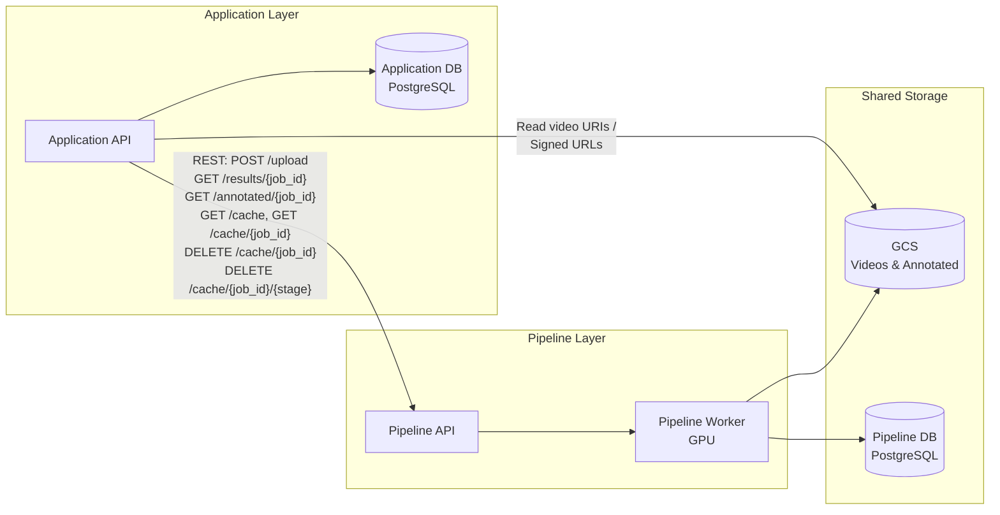
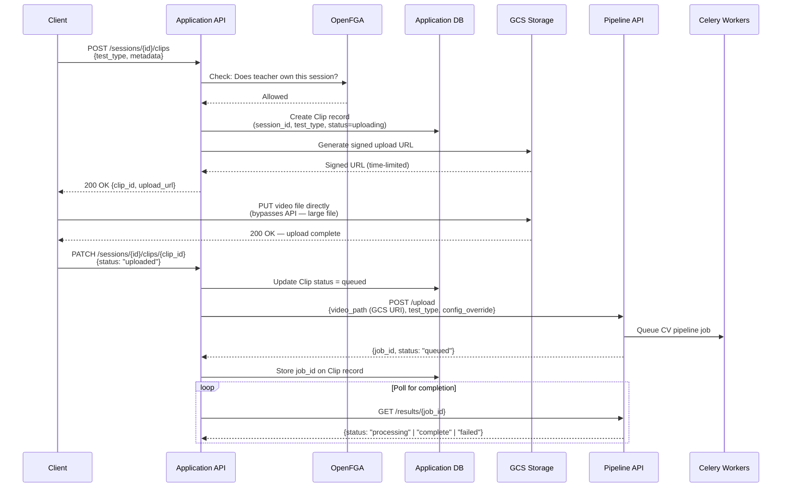
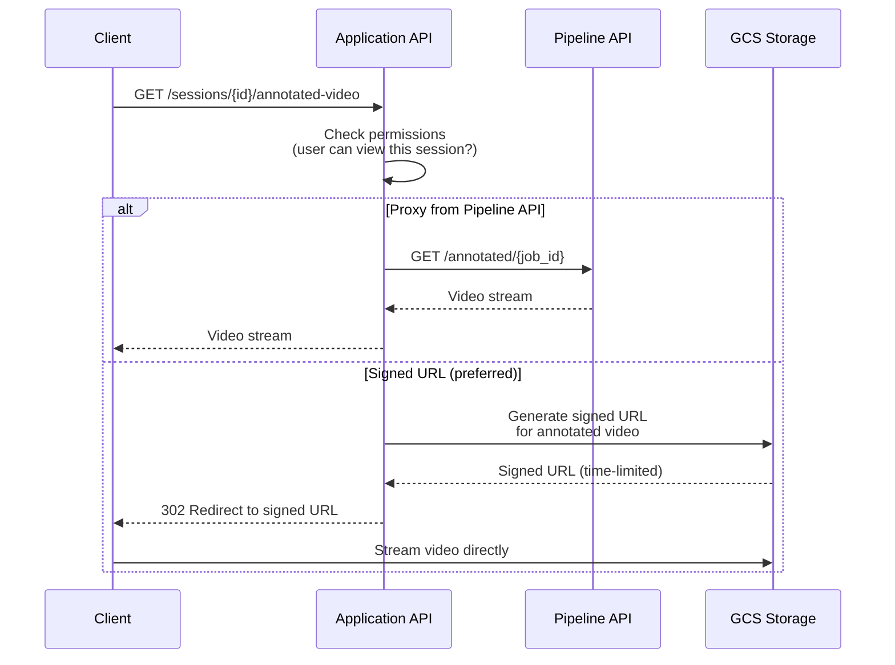

# Pipeline Integration

## 1. Overview

The existing CV pipeline is treated as an internal service. The Application API is the sole consumer. This document defines the integration boundary: how the application layer submits jobs, tracks progress, ingests results, and manages the pipeline without modifying its internals.

The pipeline remains a self-contained system with its own API, configuration, and storage conventions. The application layer orchestrates it through well-defined endpoints and shared storage, never reaching into pipeline internals.

The pipeline processes video through **8 sequential stages**: Ingest, Detect, Track, Pose, OCR, Calibrate, Extract, Output. Each stage produces intermediate outputs that are cached, allowing selective re-runs without reprocessing the entire pipeline. See [01-pipeline-architecture.md](../01-pipeline-architecture.md) for full stage details.

## 2. Integration Boundary

The application layer and the pipeline meet at a narrow seam: REST endpoints and shared GCS/PostgreSQL storage.



**Key constraints:**

- Application API is the orchestrator. Pipeline API is the worker.
- Communication is via REST (Pipeline API endpoints) and shared storage (GCS for videos, PostgreSQL for results).
- Application API does NOT modify pipeline code.
- Pipeline API does NOT know about users, schools, permissions, or bib-to-student mapping.

### Pipeline API Routes (from POC)

These routes are internal — only the Application API calls them. They match the existing POC implementation (see [04-api-reference.md](../04-api-reference.md)).

| Method | Route | Description |
|---|---|---|
| `POST` | `/upload` | Submit video + test type. Returns `job_id`. POC accepts multipart/form-data (`file`, `test_type`, `config_override`, `enable_pose`, `enable_ocr`). |
| `GET` | `/results/{job_id}` | Poll processing status and retrieve results when complete. Returns `{job_id, status, results}`. |
| `GET` | `/annotated/{job_id}` | Stream the annotated video with overlays. |
| `GET` | `/health` | Liveness check. Returns `{status, version}`. |
| `GET` | `/cache` | List all cached jobs with stages and sizes. |
| `GET` | `/cache/{job_id}` | Inspect cache for a specific job (stages cached, size, available stages). |
| `DELETE` | `/cache/{job_id}` | Clear entire cache for a job. |
| `DELETE` | `/cache/{job_id}/{stage}` | Invalidate from a specific stage onwards (cascading). Valid stages: `ingest`, `detect`, `track`, `pose`, `ocr`, `calibrate`, `results`. |

> **Note on `/upload` adaptation**: The POC's `/upload` currently accepts a multipart file upload. For production, this will need to accept a GCS URI instead, since the Application API orchestrates direct-to-GCS uploads and never touches video bytes. The contract change is: replace the `file` field with a `video_path` field containing the GCS URI. All other parameters (`test_type`, `config_override`, `enable_pose`, `enable_ocr`) remain the same.

## 3. Job Submission Flow

The upload flow uses **Option B (task before upload)** as decided in [00-system-overview.md](./00-system-overview.md). The Application API creates a task record and signed URL before the client uploads, ensuring a trackable handle exists at every step.



**Key points:**

- The Clip record exists *before* the upload begins, giving the client a handle to track state.
- The client uploads directly to GCS via signed URL — no video bytes flow through either API.
- The Application API submits to the Pipeline API only after the client confirms upload completion.
- The pipeline is unaware of sessions, clips, or any application-layer concept. It receives a video path, a test type, and optional config, and returns a job ID.
- Orphaned uploads (client crashes mid-upload) are trackable via Clip records stuck in `uploading` status.

## 4. Status Polling

### Current: Polling (MVP)

The Application API polls the Pipeline API's `/results/{job_id}` endpoint on a fixed interval (e.g. every 5 seconds). Clients, in turn, poll the Application API for status updates on their session.

- Simple to implement, no additional infrastructure.
- Adds latency equal to the polling interval.
- Acceptable for MVP where a teacher uploads a video and waits.

**Pipeline status values** (from `GET /results/{job_id}`):

| Status | Meaning |
|--------|---------|
| `pending` | Queued, not yet started |
| `processing` | Pipeline running |
| `complete` | All stages done, results available |
| `failed` | Pipeline error |

### Planned: Stage-Level Progress

The Celery worker already calls `self.update_state()` with stage-level metadata as it moves through the 8 pipeline stages, and this data is stored in Redis. However, `GET /results/{job_id}` currently only returns a top-level status — it does not surface which stage is running.

A proposed enhancement (see [`docs/todo/01-pipeline-status-endpoint.md`](../todo/01-pipeline-status-endpoint.md)) would either extend `/results/{job_id}` or add a dedicated `GET /status/{job_id}` endpoint to expose:

- **Current stage** — number (1-8) and name (Ingest, Detect, Track, Pose, OCR, Calibrate, Extract, Output)
- **Per-stage status** — complete, running, or pending
- **Stage toggle flags** — whether Pose and OCR stages are enabled or skipped
- **Progress hint** — percentage estimate or ETA

This would power a stage-by-stage progress display in the Teacher App's Pipeline Status screen, which is a meaningful UX improvement over a simple spinner given that processing takes 30-120 seconds per clip.

### Future: Event-Driven (Enhanced)

The pipeline worker could publish stage-level updates to Redis pub/sub. The Application API would subscribe and push updates to clients via WebSocket.

- Near-real-time progress (e.g. "Stage 3/8: Tracking complete").
- Requires WebSocket infrastructure in the Application API.
- Enhancement for a future phase after the stage-level polling endpoint is established.

**Decision: Polling for MVP.** Stage-level polling endpoint as the first enhancement. WebSocket/pub-sub as a later optimisation.

## 5. Result Ingestion

When the pipeline completes a job, the Application API ingests the results and maps them to application-layer entities.

**Pipeline response structure** (`GET /results/{job_id}` when status = `complete`):

Each `TestResult` object contains (matching the POC's `pipeline/models.py` — see [02-data-models.md](../02-data-models.md)):

| Field | Type | Description |
|---|---|---|
| `student_bib` | int | Bib number detected by OCR. `-1` if unresolved. |
| `track_id` | int | Internal tracking ID from the pipeline |
| `test_type` | string | `"explosiveness"`, `"speed"`, `"fitness"`, `"agility"`, or `"balance"` |
| `metric_value` | float | The measured result (e.g. 34.2) |
| `metric_unit` | string | `"cm"`, `"s"`, or `"m"` |
| `attempt_number` | int | Which attempt (1-3 for multi-attempt tests) |
| `confidence_score` | float | Pipeline confidence: 0.0-1.0. Base 0.8 if bib resolved, 0.4 if unresolved, multiplied by test-specific quality factors. |
| `flags` | string[] | Warning flags: `"bib_unresolved"`, `"low_pose_confidence"`, `"invalid_calibration"` |
| `raw_data` | JSON | Test-specific intermediate values for debugging |

**Ingestion steps:**

1. Application API fetches `GET /results/{job_id}` and receives the list of TestResult objects.
2. For each TestResult:
   - Look up `student_bib` in the [`BibAssignment`](./01-domain-model.md) table for this session (`WHERE session_id = S AND bib_number = N`) to resolve `student_id`.
   - If bib is resolved: create a `Result` record with `student_id` and `bib_assignment_id` populated.
   - If bib is unresolved (`student_bib = -1` or no `BibAssignment` match): create a `Result` record with `student_id = NULL`, flagged for manual review.
3. Update the Clip record: `status = complete`.
4. Update the TestSession record: `status = review` (see [06-data-flow.md](./06-data-flow.md) session lifecycle).

Teachers then review and approve results through the Results Processing screen in the Teacher App. The approval flow — including bib mismatch correction and bulk approval of high-confidence results — is detailed in [06-data-flow.md](./06-data-flow.md), section 5.

## 6. Annotated Video Access



The signed URL approach is preferred for production as it offloads bandwidth from the Application API. The proxy approach is useful during development or when GCS signed URLs are not yet configured.

## 7. Cache Management Integration

The pipeline caches intermediate results at each stage to `data/cache/{job_id}/` (see [01-pipeline-architecture.md](../01-pipeline-architecture.md) for the full cache structure). The Application API exposes cache management to admin users, mapping directly to Pipeline API cache endpoints.

| Application Action | Pipeline API Call | Use Case |
|---|---|---|
| List all cached jobs | `GET /cache` | Admin dashboard — view all cached jobs with stages and sizes |
| View cache status | `GET /cache/{job_id}` | Admin inspects which stages are cached for a job |
| Re-run from stage | `DELETE /cache/{job_id}/{stage}` | OCR failed, invalidate from that stage and all downstream |
| Clear all cache | `DELETE /cache/{job_id}` | Full reprocessing needed |

**Valid cache stages** (matching the POC): `ingest`, `detect`, `track`, `pose`, `ocr`, `calibrate`, `results`.

**Stage invalidation is cascading**: deleting a stage removes all downstream stages too. For example, `DELETE /cache/{job_id}/ocr` invalidates `ocr`, `calibrate`, and `results`, retaining `ingest`, `detect`, `track`, and `pose`.

**Re-processing flow:**

1. Teacher reports incorrect results for a clip.
2. Admin determines OCR failed (e.g. bib numbers wrong).
3. Admin triggers "re-run from OCR" in the application UI.
4. Application API calls `DELETE /cache/{job_id}/ocr` — pipeline invalidates OCR and all downstream stages.
5. Application API re-submits the job via `POST /upload` with the same GCS video path.
6. Pipeline re-runs from the OCR stage, using cached upstream results (Ingest, Detect, Track, Pose).
7. New results are ingested via the standard ingestion flow (section 5), replacing the previous Result records.

## 8. Configuration Passthrough

The pipeline stores test-specific configuration in `configs/test_configs/{test_type}.json`. The Application API can override specific values at submission time.

```mermaid
graph TD
    A[Application API] -->|POST /upload| P[Pipeline API]

    subgraph Payload
        VP[video_path: GCS URI]
        TT[test_type: e.g. agility]
        CO[config_override: JSON]
        EP[enable_pose: bool]
        EO[enable_ocr: bool]
    end

    subgraph Config Resolution
        DC[Default Config<br/>configs/test_configs/{test_type}.json]
        OV[config_override from request]
        MC[Merged Config<br/>default + overrides]
    end

    P --> DC
    P --> OV
    DC --> MC
    OV --> MC
    MC --> PW[Pipeline Worker]
```

**Use case:** A specific school's hall has non-standard dimensions. The cone spacing differs from the default configuration.

1. School admin sets a config override in the application (e.g. `{"cone_spacing_m": 18.0}`).
2. Application API stores this in its own DB as a per-school config override.
3. On job submission, Application API merges the school override into the `config_override` field sent to the Pipeline API.
4. Pipeline API merges the override onto the default config for that test type.
5. Pipeline processes the video with the adjusted parameters.

**Stage toggles** can also be passed per-job via `enable_pose` and `enable_ocr` parameters. When disabled: Pose stage produces empty output (skeleton overlays hidden, balance extractor disabled); OCR stage is skipped (all `bib_number` remain `None`, `track_id` used as fallback identity).

## 9. Error Handling

Pipeline failures are treated as job-level failures. They do not propagate into application internals.

**Failure flow:**

1. Pipeline returns `status: "failed"` with an error message on `GET /results/{job_id}`.
2. Application API sets the Clip record to `status = failed`.
3. Application API sets the TestSession to `status = failed` (see [06-data-flow.md](./06-data-flow.md) session lifecycle states).
4. Application API logs the error with the `job_id` and error details.
5. Teacher is notified (in-app notification or session status indicator).
6. Teacher can retry (re-submit the same video via `POST /upload`) or re-record.
7. On retry, Application API resets the Clip and session status to `queued`, and the standard flow resumes.

**Common failure modes:**

| Failure | Cause | Recovery |
|---|---|---|
| GPU out of memory | Video too long or too high resolution | Re-upload a shorter clip or lower resolution |
| Calibration failure | Not enough cones visible in frame | Re-record with visible calibration markers |
| Video corruption | Upload interrupted or codec issue | Re-upload the video |
| OCR failure | Bib numbers not readable | Results created with `student_bib = -1`, flagged for manual review (not a hard failure) |
| Timeout | Processing exceeded time limit | Retry; if persistent, check video length |

## 10. Data Mapping

How pipeline `TestResult` fields map to the application's `Result` entity (see [01-domain-model.md](./01-domain-model.md)):

| Pipeline Field (`TestResult`) | Application Field (`Result`) | Mapping |
|---|---|---|
| `student_bib` | `student_id` | Via [`BibAssignment`](./01-domain-model.md) lookup: `WHERE session_id = S AND bib_number = student_bib` → resolves to `student_id` |
| `student_bib` | `bib_assignment_id` | The matched BibAssignment record's ID |
| `track_id` | (not stored on Result) | Available in `raw_data` for debugging |
| `test_type` | `result.test_type` | Direct mapping. Values: `"explosiveness"`, `"speed"`, `"fitness"`, `"agility"`, `"balance"` |
| `metric_value` | `result.metric_value` | Direct mapping |
| `metric_unit` | `result.metric_unit` | Direct mapping |
| `attempt_number` | `result.attempt_number` | Direct mapping |
| `confidence_score` | `result.confidence_score` | Direct mapping |
| `flags` | `result.flags` | Direct mapping (text array) |
| `raw_data` | `result.raw_data` | Direct mapping (JSONB) |
| `job_id` (from response envelope) | `clip.job_id` | Stored on the Clip record, not on individual Results |

The critical mapping is `student_bib` to `student_id`. This is the point where pipeline output (anonymous bib numbers) becomes application data (named students with results). The [`BibAssignment`](./01-domain-model.md) table, scoped to the session, is the bridge.

## 11. Five Test Types

The pipeline supports five fitness tests, each with a dedicated metric extractor (Stage 7). The `test_type` value is passed to the Pipeline API on job submission and determines which extractor runs.

| test_type value | Fitness Attribute | Metric | Unit | Key Keypoints Used |
|---|---|---|---|---|
| `explosiveness` | Explosiveness | Jump height | `cm` | Ankles (15, 16) |
| `speed` | Speed | Time | `s` | Hips (11, 12) |
| `fitness` | Fitness | Distance per 15s set | `m` | Hips (11, 12) |
| `agility` | Agility | Completion time | `s` | Hips (11, 12) |
| `balance` | Balance | Hold duration | `s` | Ankles + Hips + Nose |

## 12. Future Enhancements

- **Pipeline `/upload` contract change**: Adapt `POST /upload` from multipart file upload to accept a GCS URI directly. This is required for the production upload flow where clients upload to GCS via signed URL and the Application API passes the path.
- **Stage-level status endpoint**: Implement the proposal in [`docs/todo/01-pipeline-status-endpoint.md`](../todo/01-pipeline-status-endpoint.md) to expose per-stage progress.
- **Event-driven completion**: Pipeline publishes completion events to Redis pub/sub instead of requiring the Application API to poll.
- **gRPC instead of REST** for pipeline communication. Lower latency, streaming support for stage-by-stage progress.
- **Pipeline orchestration & job queuing**: Introduce Pub/Sub-based job queuing and a configurable pipeline runner with per-test-type step selection. See [`docs/todo/02-pipeline-orchestration.md`](../todo/02-pipeline-orchestration.md) for the full plan, including GPU memory management and scaling strategy. Decision: no DAG orchestrator (Airflow/Temporal) until pipeline topology has genuine branching complexity; Vertex AI Pipelines is the GCP fallback if needed.
- **Multi-worker distribution**: Distribute jobs across multiple GPU VMs with a job queue (already supported by Celery architecture).
- **Pipeline versioning**: Track which pipeline version produced which results. Store `pipeline_version` on the Clip record for reproducibility and auditing.

## 13. Open Questions

| # | Question | Context | Status |
|---|---|---|---|
| 1 | Raw result retention — do we store raw pipeline results (pre-approval) in the Application DB, or just reference them via job_id? | Keeping raw results enables re-review without re-running the pipeline. Referencing via job_id is simpler but depends on pipeline cache retention. | Open |
| 2 | Pipeline downtime — how do we handle Pipeline API downtime? | Queue jobs in the Application DB and retry on a schedule, or rely on Celery's retry mechanisms. | Open |
| 3 | Config override storage — should per-school config overrides live in the Application DB or in the pipeline's config files? | Application DB is cleaner for multi-tenancy (each school's overrides are data, not deployment config). | Leaning Application DB |

### Resolved Questions

| Question | Resolution | Decided In |
|---|---|---|
| Annotated video storage — pipeline writes directly or Application API handles it? | Pipeline writes annotated video to GCS directly (existing POC behaviour). Application API generates signed URLs for client access. | This doc, section 6 |
| Upload flow — file through API or direct to GCS? | Direct to GCS via signed URL. Task created before upload (Option B). API never touches video bytes. | [00-system-overview.md](./00-system-overview.md) |
| Real-time progress vs polling? | Polling for MVP. Stage-level endpoint as first enhancement. WebSocket/pub-sub later. | [00-system-overview.md](./00-system-overview.md), this doc section 4 |
