# User Flows

## Overview

This document defines the primary user flows for the Vigour platform, documented from the **user's perspective** — what they see, what they do, and what decisions they make. Each flow uses Mermaid flowchart diagrams with consistent conventions:

| Shape | Meaning |
|-------|---------|
| Rounded rectangle `([...])` | User action — something the user initiates |
| Rectangle `[...]` | Screen or UI state — what the user sees |
| Diamond `{...}` | Decision point — a choice the user must make |
| Hexagon `{{...}}` | System response — feedback shown to the user |
| Stadium `([...])` | Start / end point |
| Double-bordered `[[...]]` | Error state or failure the user encounters |

Cross-references to architecture docs are provided where flows touch domain entities, API routes, auth mechanisms, or data ownership boundaries.

---

## 1. Teacher: Complete Session Workflow

The primary operational flow. A teacher creates a test session, records video, and shepherds results through to approval. This is the flow that drives all downstream data — coach dashboards and school dashboards all depend on sessions completing successfully.

References: [01-domain-model.md](./01-domain-model.md) (session lifecycle, bib assignments), [02-api-architecture.md](./02-api-architecture.md) (upload flow), [05-client-applications.md](./05-client-applications.md) (Teacher App screens), [06-data-flow.md](./06-data-flow.md) (canonical state machine).

### 1a. Session Setup and Recording

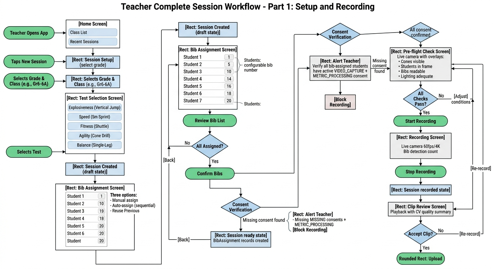

```mermaid
flowchart TD
    START(["Teacher opens Teacher App"]) --> HOME["Home Screen\nList of classes and recent sessions"]
    HOME --> NEW(["Taps 'New Session'"])
    NEW --> GRADE["Session Setup Screen\nSelect grade\n(from school's configured grades)"]
    GRADE --> CLASS(["Selects grade, then class\ne.g. Gr 6 - 6A"])
    CLASS --> TEST["Test Select Screen\nShows class info: 'Gr 6 - 6A · Mrs. van Wyk · 28 students'\nFive test options:\nExplosiveness (Vertical Jump)\nSpeed (5m Sprint)\nFitness (Shuttle Sprints)\nAgility (Cone Drill)\nBalance (Single-Leg Hold)"]
    TEST --> SELTEST(["Selects test type\ne.g. Explosiveness"])
    SELTEST --> CREATED{{"Session created in 'draft' state\nTestSession record saved"}}
    CREATED --> BIB["Bib Assignment Screen\nList of 28 students in class\nEach needs a bib number (1-30)"]

    BIB --> BIBMETHOD{"How to assign bibs?"}
    BIBMETHOD -->|"Manual"| MANUAL(["Assigns bib numbers\none-by-one to each student"])
    BIBMETHOD -->|"Auto-assign"| AUTO(["Taps 'Auto-Assign'\nSequential bib numbers"])
    BIBMETHOD -->|"Reuse last session"| REUSE(["Taps 'Reuse Previous'\nCopies bib layout from last session"])

    MANUAL --> BIBREVIEW["Review bib list\nAll students have a number?"]
    AUTO --> BIBREVIEW
    REUSE --> BIBREVIEW

    BIBREVIEW --> BIBCHECK{"All students assigned?"}
    BIBCHECK -->|"No — missing students"| BIB
    BIBCHECK -->|"Yes"| CONFIRM(["Taps 'Confirm Bibs'"])
    CONFIRM --> READY{{"Session moves to 'ready' state\nBibAssignment records created"}}

    READY --> PREFLIGHT["Pre-flight Check Screen\nLive camera preview with overlays:\n- Cones visible? ✓/✗\n- Students in frame? ✓/✗\n- Bibs readable? ✓/✗\n- Lighting adequate? ✓/✗"]

    PREFLIGHT --> PRECHECK{"All checks pass?"}
    PRECHECK -->|"No"| ADJUST(["Teacher adjusts setup\nMoves camera / repositions students"])
    ADJUST --> PREFLIGHT
    PRECHECK -->|"Yes"| RECORD(["Taps 'Start Recording'"])

    RECORD --> RECORDING["Recording Screen\nLive camera feed at 60fps / 4K\nOverlay: bib detection count,\ntracking indicators, elapsed time"]
    RECORDING --> STOP(["Taps 'Stop Recording'\nwhen test is complete"])
    STOP --> RECORDED{{"Session moves to 'recorded' state\nVideo saved locally on device"}}
    RECORDED --> REVIEW_CLIP["Clip Review Screen\nPlayback of recorded video\nCV quality summary:\n- Students detected: 28/28\n- Bibs read: 26/28\n- Quality: Good"]

    REVIEW_CLIP --> CLIPDECISION{"Accept this clip?"}
    CLIPDECISION -->|"No — re-record"| RERECORD(["Taps 'Re-record'\nDiscards clip"])
    RERECORD --> PREFLIGHT
    CLIPDECISION -->|"Yes — upload"| ACCEPT(["Taps 'Upload'"])
```

### 1b. Upload, Processing, and Results

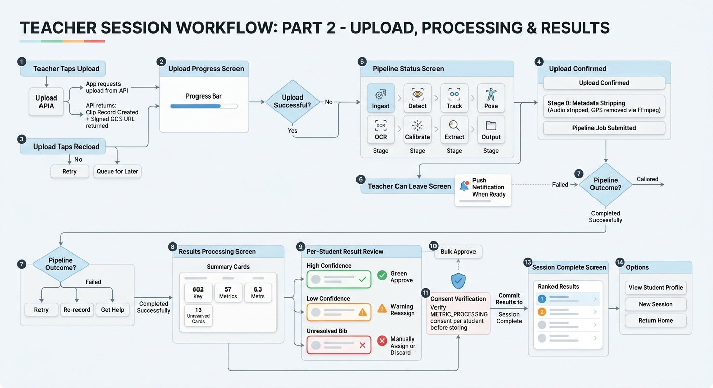

```mermaid
flowchart TD
    ACCEPT(["Teacher taps 'Upload'"]) --> UPLOAD{{"App requests upload from API\nClip record created + signed GCS URL returned\nSession moves to 'uploading'"}}
    UPLOAD --> UPLOADING["Upload Progress Screen\nProgress bar: 0% → 100%\nEstimated time remaining\n'Do not close the app'"]

    UPLOADING --> UPLOADRESULT{"Upload successful?"}
    UPLOADRESULT -->|"No — network error"| UPLOADFAIL[["Upload Failed\n'Upload interrupted.\nYour video is saved locally.'"]]
    UPLOADFAIL --> RETRY_UPLOAD{"Retry?"}
    RETRY_UPLOAD -->|"Yes"| ACCEPT
    RETRY_UPLOAD -->|"Later"| QUEUED_LOCAL{{"Video queued locally\nWill auto-retry when\nconnectivity returns"}}

    UPLOADRESULT -->|"Yes"| SUBMITTED{{"Upload confirmed\nPipeline job submitted\nSession moves to 'queued'"}}
    SUBMITTED --> PIPELINE["Pipeline Status Screen\nProgress through 8 stages:\n1. Ingest ▓▓▓▓ complete\n2. Detect ▓▓░░ in progress\n3. Track ░░░░ pending\n4. Pose ░░░░ pending\n5. OCR ░░░░ pending\n6. Calibrate ░░░░ pending\n7. Extract ░░░░ pending\n8. Output ░░░░ pending"]

    PIPELINE --> CANLEAVE{{"'You can leave this screen.\nWe will notify you when\nresults are ready.'"}}
    CANLEAVE --> WAIT{"Teacher waits or leaves?"}
    WAIT -->|"Waits"| PIPELINE
    WAIT -->|"Leaves"| OTHER(["Does other work in the app\nor puts phone away"])
    OTHER --> NOTIFY{{"Push notification:\n'Results ready for Gr 6 - 6A\nVertical Jump'"}}
    NOTIFY --> OPENRESULTS(["Taps notification"])

    PIPELINE --> PIPERESULT{"Pipeline outcome?"}
    PIPERESULT -->|"Success"| REVIEW
    PIPERESULT -->|"Failed"| PIPEFAIL[["Pipeline Failed Screen\n'Processing failed.\nThis may be due to video quality\nor a system error.'"]]

    PIPEFAIL --> FAILCHOICE{"What does the teacher do?"}
    FAILCHOICE -->|"Retry processing"| RESUBMIT(["Taps 'Retry Processing'"])
    RESUBMIT --> PIPELINE
    FAILCHOICE -->|"Re-record"| BACKRECORD(["Taps 'Re-record'\nGoes back to pre-flight"])
    FAILCHOICE -->|"Contact support"| SUPPORT(["Taps 'Get Help'\nOpens support chat / email"])

    OPENRESULTS --> REVIEW

    REVIEW["Results Processing Screen\nHeader: 'Vertical Jump · Gr 6'\nSummary cards: 6 Tracked · 4 High conf. · 2 Review\nPer-student result list with\nconfidence indicators"]

    REVIEW --> RESULTTYPE{"Review each result"}

    RESULTTYPE -->|"High confidence ✓\n(green checkmark)"| HIGHCONF["Result row:\nLiam van der Berg · #04 · 42cm\nConfidence: High"]
    HIGHCONF --> APPROVE_ONE(["Taps ✓ to approve"])

    RESULTTYPE -->|"Low confidence ⚠\n(warning triangle)"| LOWCONF["Result row:\nKeenan Jacobs · #09 · 45cm\nConfidence: Low — possible bib misread"]
    LOWCONF --> LOWDECISION{"Accept or fix?"}
    LOWDECISION -->|"Accept as-is"| APPROVE_ONE
    LOWDECISION -->|"Reassign to\ndifferent student"| REASSIGN(["Taps student name\nSearches/selects correct student\nfrom class list"])
    REASSIGN --> APPROVE_ONE

    RESULTTYPE -->|"Unresolved bib ✗\n(red X)"| UNRESOLVED["Result row:\nUnknown · #?? · 38cm\nBib could not be read"]
    UNRESOLVED --> UNRESDECISION{"Can teacher identify\nthe student?"}
    UNRESDECISION -->|"Yes"| MANUALASSIGN(["Taps 'Assign Student'\nSelects student from class list"])
    MANUALASSIGN --> APPROVE_ONE
    UNRESDECISION -->|"No — discard"| DISCARD(["Taps ✗ to reject result\nResult excluded from profiles"])

    APPROVE_ONE --> ALLREVIEWED{"All results reviewed?"}
    ALLREVIEWED -->|"No"| RESULTTYPE
    ALLREVIEWED -->|"Yes"| COMMIT

    REVIEW --> BULKAPPROVE(["Taps 'Approve All High Conf.'\nBulk-approves all results with\nconfidence > 0.8"])
    BULKAPPROVE --> REMAINING{"Any remaining results\nto review?"}
    REMAINING -->|"Yes — low conf / unresolved"| RESULTTYPE
    REMAINING -->|"No — all approved"| COMMIT

    COMMIT(["Taps 'Commit Results to Profiles'"]) --> COMMITTED{{"Session moves to 'complete'\nApproved results linked to student profiles"}}
    COMMITTED --> FINAL["Session Complete Screen\nRanked results:\n1. Ruan Botha · 48cm\n2. Keenan Jacobs · 45cm\n3. Liam van der Berg · 42cm\n4. Zara Naidoo · 38cm\n5. Amara Dlamini · 35cm\n6. Chloé Pretorius · 31cm"]

    FINAL --> NEXT{"What next?"}
    NEXT -->|"View student"| PROFILE(["Taps a student name\nOpens Student Profile"])
    NEXT -->|"New session"| NEWSESSION(["Taps 'New Session'\nStarts another test for this class"])
    NEXT -->|"Done"| HOME(["Returns to Home Screen"])
```

---

## 2. Teacher: First-Time Login (Magic Link)

The onboarding experience for a teacher who has been provisioned by a super admin and receives their first invite. No passwords — authentication is via a 6-digit email code.

References: [03-authentication.md](./03-authentication.md) (magic link flow), [04-authorization.md](./04-authorization.md) (relationship tuples written at provisioning).

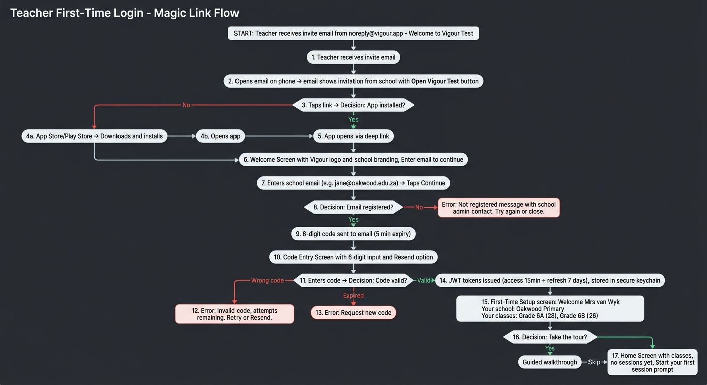

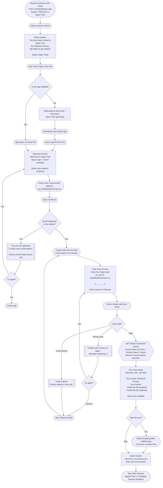

---

## 3. School Onboarding

The admin-driven process that brings a new school onto the platform. Involves the Vigour super admin and the school head. There is no self-signup — every school is provisioned after a contract is signed.

References: [03-authentication.md](./03-authentication.md) (onboarding flow, ZITADEL orgs), [04-authorization.md](./04-authorization.md) (relationship lifecycle, tuple operations).

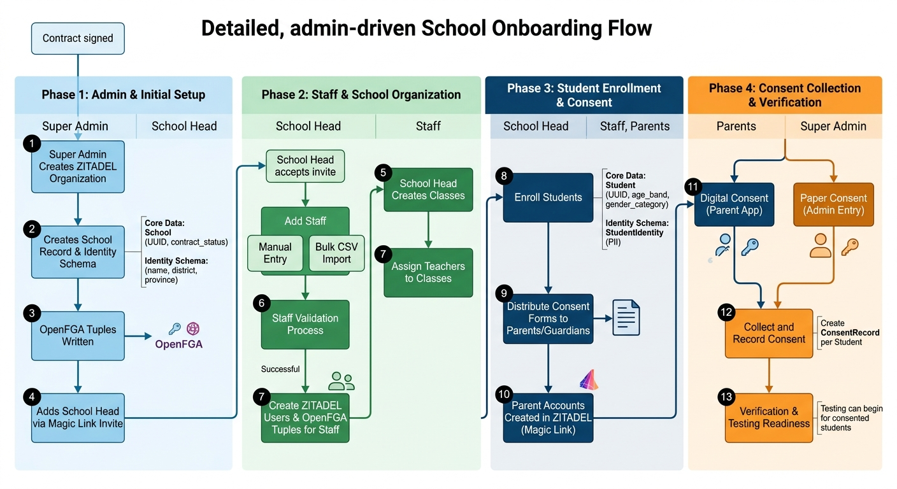

```mermaid
flowchart TD
    START(["Contract signed between\nschool and Vigour"]) --> SA_LOGIN(["Super admin logs into\nAdmin UI"])

    SA_LOGIN --> CREATE_ORG(["Creates ZITADEL Organization\nfor the school"])
    CREATE_ORG --> CREATE_SCHOOL(["Creates School record\nin Application DB\nName, district, province"])
    CREATE_SCHOOL --> WRITE_TUPLES{{"OpenFGA tuples written:\nschool:X → parent_platform → platform:vigour"}}

    WRITE_TUPLES --> ADDHEAD(["Super admin adds school head\nName: Mr. Dlamini\nEmail: head@oakwood.edu.za\nRole: school_head"])
    ADDHEAD --> HEADCREATED{{"User created in ZITADEL Org\nOpenFGA tuple written:\nuser:head-uuid → school_head → school:oakwood"}}

    HEADCREATED --> HEADINVITE{{"Invite email sent to school head\nwith magic link"}}

    HEADINVITE --> ADDSTAFF{"How are staff added?"}
    ADDSTAFF -->|"Manually\none by one"| MANUAL_STAFF(["Super admin or school head\nadds each teacher/coach\nvia Admin UI"])
    ADDSTAFF -->|"Bulk CSV import"| CSV

    CSV --> CSVPREP["CSV file prepared:\nname, email, role\nMrs. van Wyk, jane@oakwood.edu.za, teacher\nMr. Botha, coach@oakwood.edu.za, coach\n..."]
    CSVPREP --> UPLOAD_CSV(["Uploads CSV via Admin UI"])
    UPLOAD_CSV --> VALIDATE{"CSV valid?"}
    VALIDATE -->|"Errors found"| CSVERROR[["Validation report:\n- Row 3: Invalid email format\n- Row 7: Duplicate email\n- Row 12: Unknown role 'admin'\n\nValid: 15/18 rows"]]
    CSVERROR --> FIXCSV(["Fixes CSV and re-uploads\nor proceeds with valid rows only"])
    FIXCSV --> VALIDATE
    VALIDATE -->|"Valid"| BULKCREATE

    MANUAL_STAFF --> STAFFCREATED
    BULKCREATE{{"Bulk user creation:\n- ZITADEL users created in school org\n- OpenFGA tuples written per user\n- Invite emails queued"}} --> STAFFCREATED

    STAFFCREATED{{"All staff provisioned\nInvite emails sent with magic links"}}

    STAFFCREATED --> HEAD_LOGIN(["School head clicks magic link\nCompletes first-time login\n(see Flow 2)"])
    HEAD_LOGIN --> SETUP_CLASSES(["School head creates classes\nvia School Head Web or\nrequests teacher to do it"])

    SETUP_CLASSES --> CLASS_CREATE["Create Class screen\nClass name: 6A\nGrade: 6\nAssign teacher: Mrs. van Wyk"]
    CLASS_CREATE --> CLASSCREATED{{"Class created\nOpenFGA tuples written:\nclass:6A → school → school:oakwood\nuser:teacher-uuid → teacher → class:6A"}}

    CLASSCREATED --> ADDSTUDENTS{"How to enrol students?"}
    ADDSTUDENTS -->|"Manual entry"| MANUAL_STUDENTS(["Teacher adds students\none by one:\nFirst name, last name,\ndate of birth, gender"])
    ADDSTUDENTS -->|"Bulk CSV"| STUDENT_CSV

    STUDENT_CSV --> STUDENTCSVPREP["Student CSV prepared:\nfirst_name, last_name, dob, gender, class\nThabo, Molefe, 2014-03-15, M, 6A\nSarah, Jones, 2014-07-22, F, 6A\n..."]
    STUDENTCSVPREP --> UPLOAD_STUDENTS(["Uploads CSV"])
    UPLOAD_STUDENTS --> STUDENT_VALIDATE{"CSV valid?"}
    STUDENT_VALIDATE -->|"Errors"| STUDENT_ERROR[["Validation report:\n- Row 5: Missing date of birth\n- Row 8: Invalid gender value\n\nValid: 26/28 rows"]]
    STUDENT_ERROR --> FIX_STUDENTS(["Fixes and re-uploads"])
    FIX_STUDENTS --> STUDENT_VALIDATE
    STUDENT_VALIDATE -->|"Valid"| ENROLLED
    MANUAL_STUDENTS --> ENROLLED

    ENROLLED{{"Students created as data records\n(no user accounts — students don't log in)\nOpenFGA tuples written:\nstudent:uuid → enrolled_student → class:6A"}}

    ENROLLED --> REPEAT{"More classes to set up?"}
    REPEAT -->|"Yes"| CLASS_CREATE
    REPEAT -->|"No"| READY

    READY{{"School is fully onboarded:\n✓ School created\n✓ Staff provisioned and invited\n✓ Classes created with teachers\n✓ Students enrolled\n\nTeachers can now create\ntheir first test sessions"}}
    READY --> FIRSTSESSION(["Teacher logs in and\nbegins first session\n(see Flow 1)"])
```

---

## 4. Coach: Reviewing Student Progress

A coach logs into the web dashboard to review class performance, drill into individual students, and track fitness trends over time. Coaches have read-only access — they cannot approve or modify results.

References: [05-client-applications.md](./05-client-applications.md) (Coach Web screens), [04-authorization.md](./04-authorization.md) (coach permissions — view only).

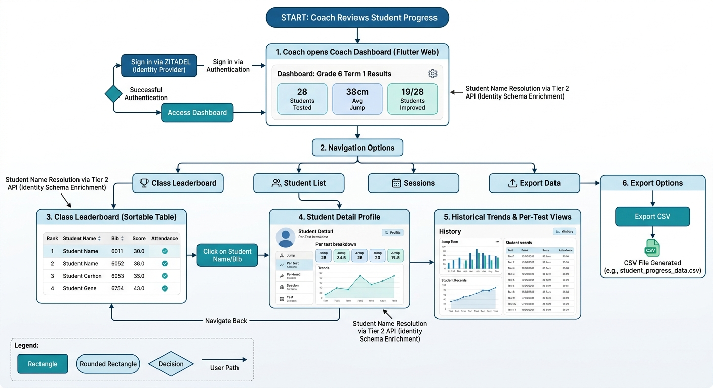

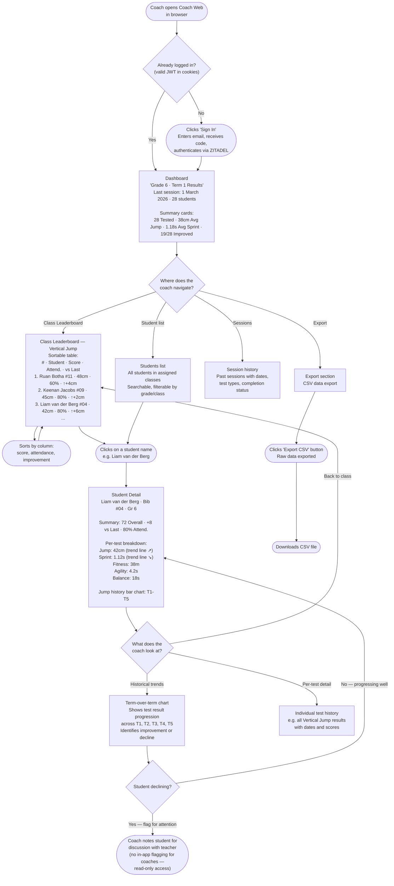

---

## 5. School Head: Term Review

A school head reviews school-wide performance, compares classes, and identifies at-risk students via the School Head Web dashboard.

References: [05-client-applications.md](./05-client-applications.md) (School Head Web screens), [06-data-flow.md](./06-data-flow.md) (data aggregation).

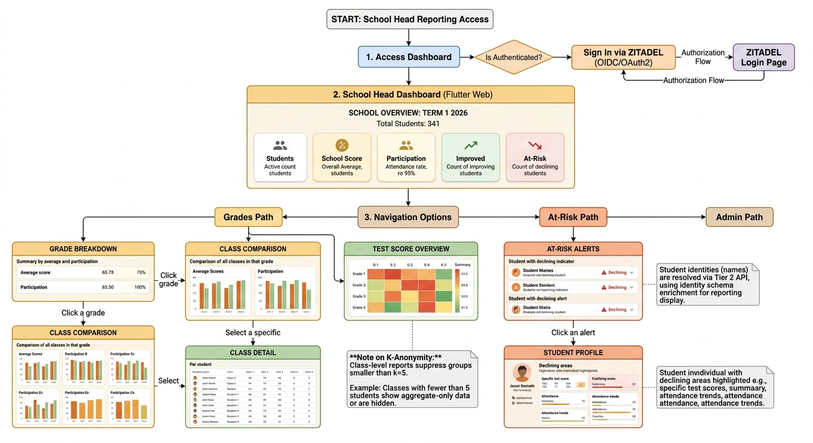

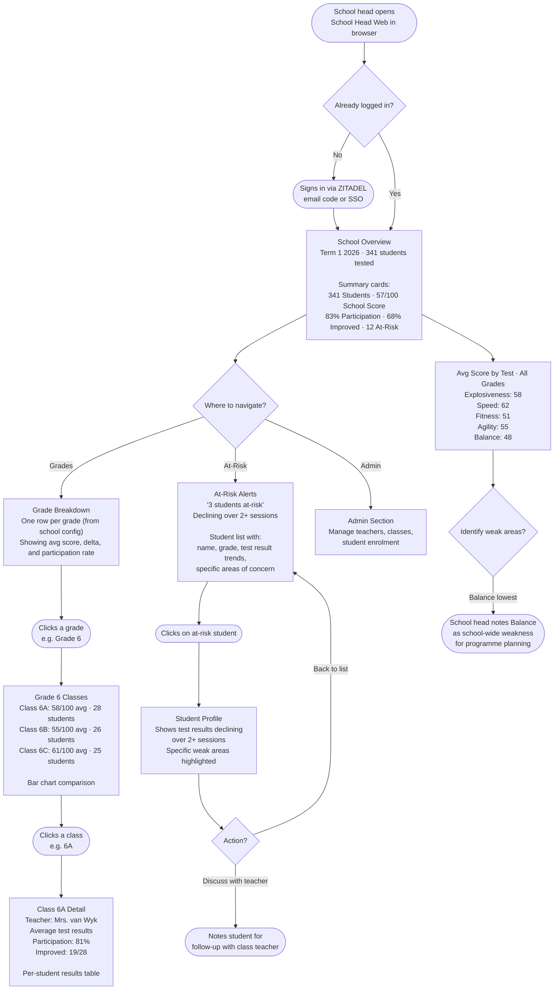

---

## 6. Student Transfer Between Schools

When a student moves from one school to another. The critical principle: results are permanently linked to the student's UUID. The old school loses access, the new school gains access to future results, and historical results can optionally be shared.

References: [01-domain-model.md](./01-domain-model.md) (students own their results, UUID as anchor), [04-authorization.md](./04-authorization.md) (student transfer scenario, tuple operations).

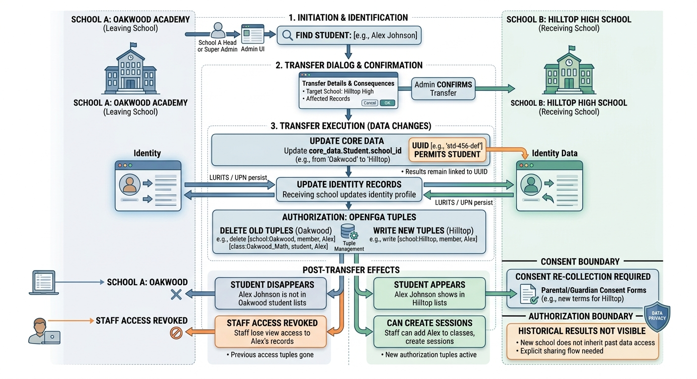

```mermaid
flowchart TD
    START(["Student is leaving School A\n(e.g. Oakwood Primary)\nfor School B\n(e.g. Hilltop Academy)"]) --> INITIATE{"Who initiates\nthe transfer?"}

    INITIATE -->|"School A head"| OLDHEAD(["School A head opens\nSchool Head Web\nNavigates to Admin → Students"])
    INITIATE -->|"Super admin"| SUPERADMIN(["Super admin opens Admin UI\nSearches for student"])

    OLDHEAD --> FINDSTUDENT["Search for student\ne.g. 'Liam van der Berg'"]
    SUPERADMIN --> FINDSTUDENT

    FINDSTUDENT --> STUDENTRECORD["Student Record\nLiam van der Berg\nGrade 6 · Class 6A\nSchool: Oakwood Primary\n\n[Transfer Student]"]

    STUDENTRECORD --> TRANSFER(["Clicks 'Transfer Student'"])
    TRANSFER --> SELECTDEST["Transfer Dialog\nSelect destination school:\n[Search schools...]\n\nSelect new class (optional):\n[Select class at new school...]\n\nNote: Historical results will remain\nlinked to this student"]

    SELECTDEST --> CHOOSESCHOOL(["Selects 'Hilltop Academy'\nand optionally a class"])
    CHOOSESCHOOL --> CONFIRM_TRANSFER{"Confirm transfer?\n\n'Liam van der Berg will be\nmoved from Oakwood Primary\nto Hilltop Academy.\n\nOakwood Primary staff will\nlose access to this student.\n\nHistorical results remain\nattached to the student.'"}

    CONFIRM_TRANSFER -->|"Cancel"| STUDENTRECORD
    CONFIRM_TRANSFER -->|"Confirm"| EXECUTE

    EXECUTE{{"Transfer executed:\n\n1. Student.school_id updated\n   Oakwood → Hilltop\n\n2. OpenFGA tuples deleted:\n   student → enrolled_student → class:6A (Oakwood)\n\n3. OpenFGA tuples written:\n   student → enrolled_student → class:7B (Hilltop)\n\n4. All Result records\n   remain linked to student UUID"}}

    EXECUTE --> OLDSCHOOLEFFECT["Effect at Oakwood Primary:\n\n- Student disappears from class 6A roster\n- Teachers/coaches can no longer\n  view student profile\n- Historical sessions still show\n  results but student marked as 'transferred'\n- No data is deleted"]

    EXECUTE --> NEWSCHOOLEFFECT["Effect at Hilltop Academy:\n\n- Student appears in assigned class\n- Teachers can create new sessions\n  including this student\n- New results accumulate under\n  the same student UUID"]

    NEWSCHOOLEFFECT --> HISTORICAL{"Does new school need\nhistorical results?"}
    HISTORICAL -->|"No — only new results\ngoing forward"| DONE
    HISTORICAL -->|"Yes — share history"| SHAREHISTORY

    SHAREHISTORY --> GRANTACCESS(["Super admin or school head\ngrants explicit access to\nhistorical results via\nOpenFGA tuple write"])
    GRANTACCESS --> SHARED{{"Hilltop staff can now view\nLiam's historical results\nfrom Oakwood sessions"}}
    SHARED --> DONE

    DONE{{"Transfer complete\n\nStudent UUID is the anchor:\n- Old results: still linked, access controlled\n- New results: accumulate at new school\n- New test results: accumulate at new school\n  once new sessions are completed"}}

    DONE --> NEWTEACHER(["Hilltop teacher logs in\nSees Liam in their class\nAssigns bibs for next session"])
```

---

## 7. Error Recovery: Failed Pipeline Processing

When the CV pipeline fails to process a video, the teacher needs a clear path to resolution. Failures can be caused by video quality issues, GPU errors, or system outages.

References: [06-data-flow.md](./06-data-flow.md) (session states: `failed`), [05-client-applications.md](./05-client-applications.md) (Pipeline Status screen).

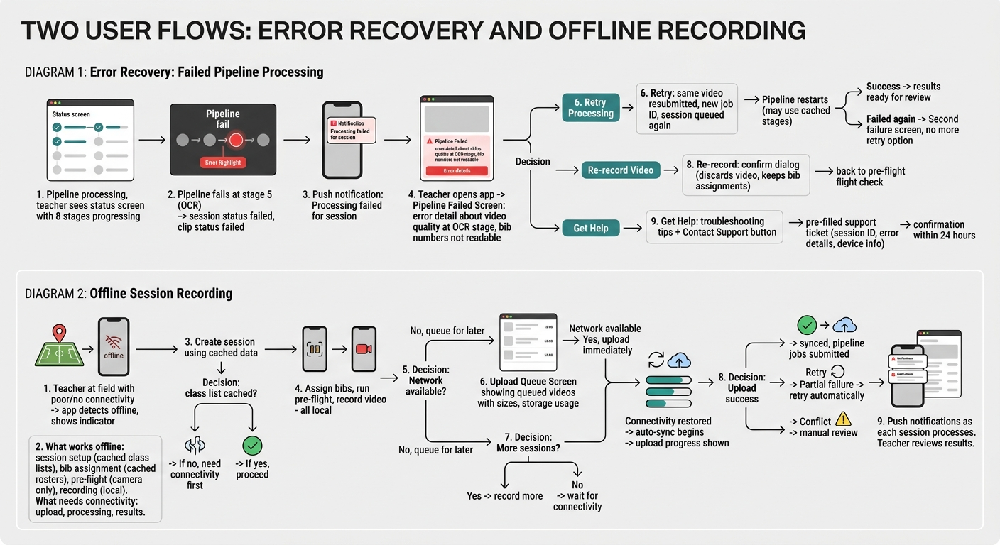

```mermaid
flowchart TD
    START(["Pipeline is processing\nTeacher sees Pipeline Status screen\nStages progressing: 1/8, 2/8, 3/8..."]) --> FAILURE{{"Pipeline fails at stage 5 (OCR)\n\nError pushed to Application API\nSession status → 'failed'\nClip status → 'failed'"}}

    FAILURE --> NOTIFICATION{{"Push notification:\n'Processing failed for\nGr 6 - 6A Vertical Jump.\nTap to view options.'"}}

    NOTIFICATION --> OPEN(["Teacher opens the app\nor taps notification"])
    OPEN --> FAILSCREEN["Pipeline Failed Screen\n\n'Processing could not complete'\n\nError detail:\n'Video quality issue at OCR stage —\nbib numbers could not be read\nclearly in frames 1240-1890.'\n\nOptions:\n[Retry Processing]\n[Re-record Video]\n[Get Help]"]

    FAILSCREEN --> CHOICE{"What does the\nteacher do?"}

    CHOICE -->|"Retry processing"| RETRY
    CHOICE -->|"Re-record"| RERECORD
    CHOICE -->|"Get help"| HELP

    RETRY(["Taps 'Retry Processing'"]) --> RESUBMIT{{"Same video resubmitted\nto pipeline\nNew job_id assigned\nSession status → 'queued'"}}
    RESUBMIT --> PIPELINE["Pipeline Status Screen\nStages restart from beginning\n(pipeline may use cached stages\nfrom previous run)"]

    PIPELINE --> RETRYRESULT{"Pipeline outcome?"}
    RETRYRESULT -->|"Success"| REVIEW(["Results ready for review\n(continues with Flow 1b)"])
    RETRYRESULT -->|"Failed again"| SECONDFAIL

    SECONDFAIL[["Second Failure\n'Processing failed again.\nThis video may have a quality issue\nthat cannot be resolved automatically.'\n\nOptions:\n[Re-record Video]\n[Get Help]"]]
    SECONDFAIL --> SECONDCHOICE{"What now?"}
    SECONDCHOICE -->|"Re-record"| RERECORD
    SECONDCHOICE -->|"Get help"| HELP

    RERECORD(["Taps 'Re-record Video'"]) --> CONFIRM_RERECORD{"Confirm?\n'This will discard the current\nvideo and start a new recording.\nBib assignments will be kept.'"}
    CONFIRM_RERECORD -->|"Cancel"| FAILSCREEN
    CONFIRM_RERECORD -->|"Confirm"| BACKTORECORD
    BACKTORECORD{{"Session status → 'ready'\nOld clip marked as 'discarded'\nBib assignments preserved"}}
    BACKTORECORD --> PREFLIGHT(["Teacher returns to\nPre-flight Check screen\nAdjusts setup based on\nerror feedback\n(continues with Flow 1a)"])

    HELP(["Taps 'Get Help'"]) --> HELPSCREEN["Help / Support Screen\n\nCommon fixes:\n- Ensure bibs face camera\n- Check lighting conditions\n- Keep students in frame\n- Avoid camera shake\n\n[Contact Support]\n[View Troubleshooting Guide]"]

    HELPSCREEN --> CONTACTSUPPORT{"Need more help?"}
    CONTACTSUPPORT -->|"Yes"| SUPPORTTICKET(["Taps 'Contact Support'\nPre-filled support request with:\n- Session ID\n- Error details\n- Device info\n- Video thumbnail"])
    SUPPORTTICKET --> ESCALATED{{"Support ticket created\nTeacher receives confirmation\n'Our team will respond\nwithin 24 hours.'"}}
    ESCALATED --> MEANWHILE{"Meanwhile?"}
    MEANWHILE -->|"Re-record now"| RERECORD
    MEANWHILE -->|"Wait for support"| WAIT(["Teacher continues with\nother sessions or tasks"])

    CONTACTSUPPORT -->|"No — troubleshooting\nguide helped"| RERECORD
```

---

## 8. Offline Session Recording

Edge case for schools with poor or intermittent connectivity. The Teacher App supports offline session setup, bib assignment, and video recording. Uploads are queued and sync when connectivity returns.

References: [05-client-applications.md](./05-client-applications.md) (offline considerations), [00-system-overview.md](./00-system-overview.md) (offline capability as cross-cutting concern).

> See also the combined diagram above in [Flow 7](#7-error-recovery-failed-pipeline-processing).

```mermaid
flowchart TD
    START(["Teacher is at a field\nwith poor/no connectivity"]) --> OFFLINE{{"App detects no network\nOffline indicator shown\nin status bar"}}

    OFFLINE --> CANIDO["What works offline:\n✓ Session Setup (cached class lists)\n✓ Bib Assignment (cached student rosters)\n✓ Pre-flight Check (camera only)\n✓ Video Recording (saved locally)\n\nWhat needs connectivity:\n✗ Upload to cloud\n✗ Pipeline processing\n✗ Results viewing"]

    CANIDO --> SETUP(["Teacher creates new session\nusing cached class data"])
    SETUP --> CLASSCACHED{"Class list available\nin local cache?"}
    CLASSCACHED -->|"Yes"| PROCEED(["Selects class and test type\nSession created locally in 'draft'"])
    CLASSCACHED -->|"No — never synced"| NOCACHE[["'Class data not available offline.\nConnect to the internet to\ndownload your class lists\nbefore going to the field.'"]]
    NOCACHE --> DONE_EARLY(["Teacher must find connectivity\nbefore proceeding"])

    PROCEED --> BIB(["Assigns bibs to students\nusing cached student roster\nAll saved locally"])
    BIB --> READY{{"Session in 'ready' state\nAll data stored on device"}}

    READY --> PREFLIGHT(["Runs pre-flight checks\nCamera-only, no network needed"])
    PREFLIGHT --> RECORD(["Records video\n60fps / 4K saved to device storage"])
    RECORD --> CLIPREVIEW(["Reviews clip locally\nDecides to accept"])

    CLIPREVIEW --> UPLOADATTEMPT{"Network available?"}
    UPLOADATTEMPT -->|"Yes — connected"| UPLOAD(["Uploads immediately\n(continues with Flow 1b)"])
    UPLOADATTEMPT -->|"No — still offline"| QUEUE

    QUEUE{{"Video queued for upload\nStored locally on device\nUpload queue persists\nacross app restarts"}}
    QUEUE --> QUEUESCREEN["Upload Queue Screen\n\nQueued uploads:\n1. Gr 6A · Vertical Jump · 1.2 GB · Queued\n2. Gr 6A · 5m Sprint · 0.9 GB · Queued\n\n'Uploads will start automatically\nwhen you reconnect.'\n\nDevice storage: 3.4 GB used / 12 GB free"]

    QUEUESCREEN --> MORESESSIONS{"Record more sessions\nwhile offline?"}
    MORESESSIONS -->|"Yes"| SETUP
    MORESESSIONS -->|"No — done for today"| WAIT

    WAIT(["Teacher finishes field work\nReturns to area with connectivity"])

    WAIT --> RECONNECT{{"Network connectivity restored\nApp detects connection"}}

    RECONNECT --> AUTOSYNC["Auto-sync begins\n\nUpload Queue:\n1. Gr 6A · Vertical Jump · Uploading... 34%\n2. Gr 6A · 5m Sprint · Waiting\n\nSync status bar visible"]

    AUTOSYNC --> SYNCISSUE{"Any sync issues?"}
    SYNCISSUE -->|"Upload succeeds"| SYNCED{{"All queued uploads complete\nSessions synced to server\nLocal drafts reconciled\nPipeline jobs submitted"}}
    SYNCISSUE -->|"Partial failure\n(intermittent connection)"| PARTIAL[["Upload interrupted\n'1 of 2 uploads complete.\nRemaining upload will retry\nautomatically.'"]]
    PARTIAL --> AUTOSYNC
    SYNCISSUE -->|"Conflict detected"| CONFLICT[["'Session data was modified\non another device.\nPlease review changes.'\n\n(Edge case: unlikely for\nsingle-teacher sessions)"]]
    CONFLICT --> RESOLVE(["Teacher reviews and\nresolves conflict manually"])
    RESOLVE --> SYNCED

    SYNCED --> NOTIFICATIONS{{"Push notifications as\neach session completes processing:\n'Results ready for Gr 6A Vertical Jump'\n'Results ready for Gr 6A 5m Sprint'"}}
    NOTIFICATIONS --> REVIEW(["Teacher reviews results\nfor each session\n(continues with Flow 1b)"])

    QUEUESCREEN --> STORAGECHECK{"Device storage\ngetting low?"}
    STORAGECHECK -->|"Yes"| STORAGEWARN[["'Storage low: 0.8 GB remaining.\nUpload queued videos before\nrecording more sessions.'"]]
    STORAGEWARN --> FINDCONNECTION(["Teacher prioritises\nfinding connectivity\nto clear queue"])
    STORAGECHECK -->|"No"| MORESESSIONS
```

---

## Appendix: Flow Cross-Reference

| Flow | Primary Actor | Touches |
|------|--------------|---------|
| 1. Complete Session Workflow | Teacher | Session lifecycle (all states), bib assignment, recording, upload, pipeline, result approval |
| 2. First-Time Login | Teacher | ZITADEL magic link, JWT issuance, app onboarding |
| 3. School Onboarding | Super Admin, School Head | ZITADEL org creation, OpenFGA tuples, bulk CSV import, class/student setup |
| 4. Coach: Student Progress | Coach | Read-only dashboards, leaderboards, student profiles, CSV export |
| 5. School Head: Term Review | School Head | School overview, grade breakdown, at-risk alerts |
| 6. Student Transfer | School Head / Super Admin | Student.school_id update, OpenFGA tuple rewrite, historical result access |
| 7. Error Recovery | Teacher | Pipeline failure, retry, re-record, support escalation |
| 8. Offline Recording | Teacher | Local caching, upload queue, auto-sync, conflict resolution |

### Session State Mapping to Flows

| Session State | Occurs In Flow(s) |
|---------------|-------------------|
| `draft` | 1a (session setup), 8 (offline) |
| `ready` | 1a (bibs assigned), 7 (after re-record), 8 (offline) |
| `recording` | 1a (capture) |
| `recorded` | 1a (clip review) |
| `uploading` | 1b (upload), 8 (sync) |
| `queued` | 1b (submitted), 7 (retry) |
| `processing` | 1b (pipeline), 7 (retry) |
| `failed` | 1b (pipeline error), 7 (error recovery) |
| `review` | 1b (teacher review) |
| `complete` | 1b (committed) |
