# Calibration Processes by Test Type

This document captures the current calibration approach for each test type in the Vigour CV pipeline, including the cone-based calibration workflow for validating cone positions within the camera FOV.

**Sprint, shuttle (linear), and fitness grid** also support **Tier 2b** (alongside **Tier 2a** cone layout): a long measuring tape establishes **depth** (along-track or along-row) in centimetres first; **cones are optional** and often used only for **horizontal** gates or layout highlights. **Tier 2b** is **more work for coaches** than **Tier 2a** and is documented in the subsections below.

---

## Overview

Calibration maps pixel coordinates to real-world measurements (centimetres). Three calibration methods exist:

| Method | Used by | What it produces |
|--------|---------|-----------------|
| **Homography** (3x3 matrix) | Agility, Sprint, Shuttle, Fitness | Full 2D pixel↔world mapping |
| **Single-axis** (px/cm scale) | Explosiveness | Vertical scale only |
| **None** | Balance | No spatial calibration needed |

### Diagram: calibration method by test type

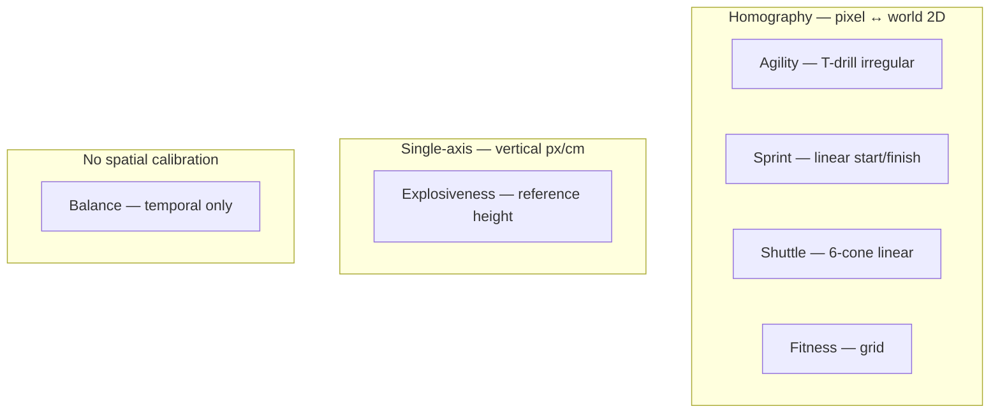

### Diagram: cone-layout homography pipeline (shared path)

Tests that use **homography** follow this pipeline; pattern-specific steps differ only inside correspondence solving.

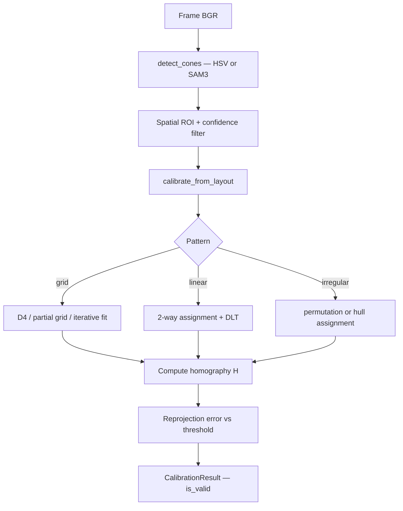

---

## Cone Detection Backends

Two detection backends are available, configured per test via `calibration_detector`:

1. **HSV segmentation** (`"hsv"`) — colour thresholding + contour centroids. Fast, works well in controlled lighting with distinct cone colours.
2. **SAM3 prompt-based** (`"sam3_prompt"`) — Segment Anything Model with text prompt. More robust to colour variation but slower and prone to over-detection when multiple test setups share the same scene.

---

## Calibration by Test Type

### 1. Agility (T-Drill)

| Property | Value |
|----------|-------|
| **Pattern** | `"irregular"` (4 cones in T-shape) |
| **Method** | Homography |
| **Requires valid calibration** | Yes |
| **Detector** | SAM3 prompt |

**World coords**: 4 cones defined explicitly in config (`cone_positions_m`).

**Correspondence solving**: Since the pattern is irregular (not a grid or line), the solver uses:
- Hull-based assignment for N>6, or full permutation for N≤6
- Selects assignment with lowest reprojection error

**Config highlights**:
```json
{
  "cone_layout": {
    "pattern": "irregular",
    "cone_count": 4,
    "reproj_error_threshold_cm": 5.0,
    "spatial_roi": { "y_min_frac": 0.40 }
  }
}
```

**Known issue**: Over-detection (28 detected vs 4 expected) when other test cones are visible in the gym. Spatial ROI filtering helps but doesn't fully solve it.

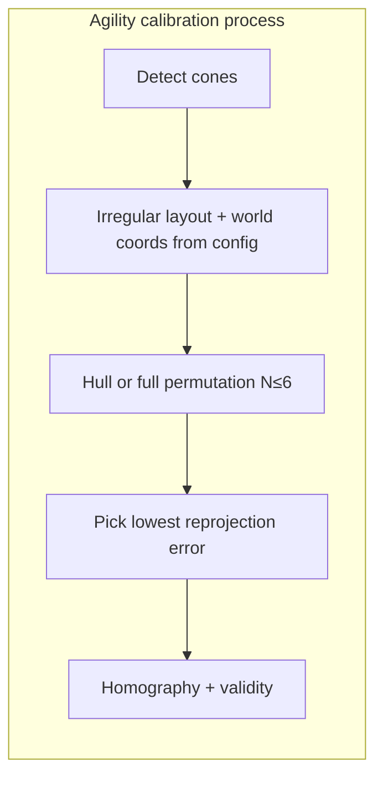

---

### 2. Sprint (5m Linear)

| Property | Value |
|----------|-------|
| **Pattern** | Linear (start/finish) |
| **Method** | Homography (or single-axis fallback) |
| **Requires valid calibration** | Yes |
| **Detector** | Default |

**How it works**: Projects hip centroid across start→finish lines using homography to map pixel X to world X. Sub-frame interpolation for timing precision.

**Config keys**: `sprint_distance_m`, `num_attempts`

#### Tier 2a: Cone-based linear gates (default)

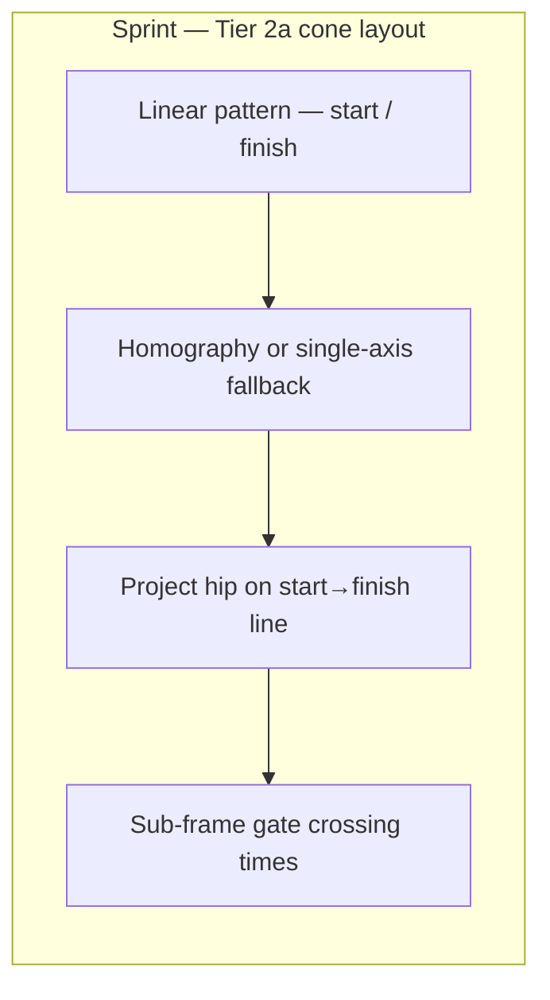

#### Tier 2b: Tape-first depth calibration (Sprint — higher coach effort)

**Intent**: Establish **depth scale first** using a long measuring tape laid along the run axis (camera depth / down the track), then optionally use cones only as **horizontal highlights** (start/finish lines, lane edges) rather than as the sole geometric anchors.

**Why it exists**: In noisy gyms, cone-only detection can fail; a tape with clear tick marks at known centimetre positions gives deterministic depth samples. Coaches must carry tape, lay it straight, and often enter or confirm mark positions in the app — **more effort** than **Tier 2a** (two cones only).

**Process (conceptual)**:

1. **Depth from tape**: Lay tape from near-camera to far end along the 5 m run. Known distances along tape (e.g. 0, 250, 500 cm) are registered — either by detecting printed marks in the frame or by the coach tapping the image at each mark with known world Y (or along-run coordinate).
2. **Scale / 1D mapping**: Pixel positions along the depth direction are mapped to cm using tape anchors (robust to missing lateral structure).
3. **Optional horizontal cones**: Place cones at start/finish **across** the lane width for visibility and gate crossing — they refine lateral alignment and FOV but tape carries primary depth calibration.

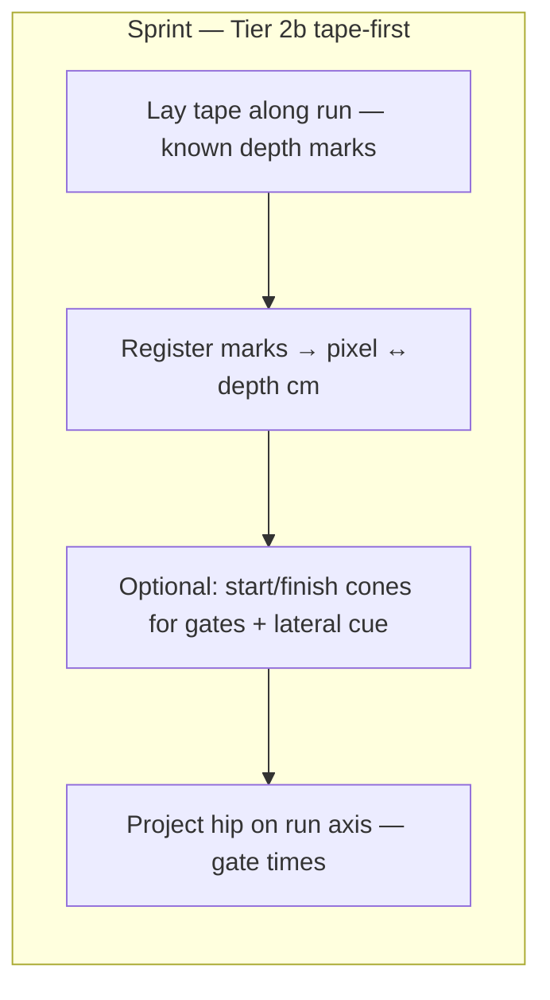

**Trade-off**: Better depth conditioning when cone detection is unreliable; **cost** is setup time, tape handling, and coach steps vs cone-only flow.

---

### 3. Shuttle Run (6-Cone Linear)

| Property | Value |
|----------|-------|
| **Pattern** | `"linear"` — 6 cones at 0, 200, 400, 600, 800, 1000 cm |
| **Method** | Homography |
| **Requires valid calibration** | Yes |
| **Detector** | SAM3 prompt |

**Correspondence**: Linear layout produces 2 candidate assignments (forward/reversed). Solver picks lowest reprojection error.

**Config highlights**:
```json
{
  "cone_layout": {
    "pattern": "linear",
    "first_cone_cm": [0, 0],
    "spacing_cm": 400,
    "direction": "x",
    "camera_orientation": "side"
  }
}
```

**Calibration usage**: Maps hip to world X via homography, detects direction reversals near cones, counts complete shuttles per 15-second set.

**Known issue**: 40 detected vs 6 expected due to other setups in scene. Spatial ROI + confidence thresholding partially mitigates.

#### Tier 2a: Six-cone linear layout (default)

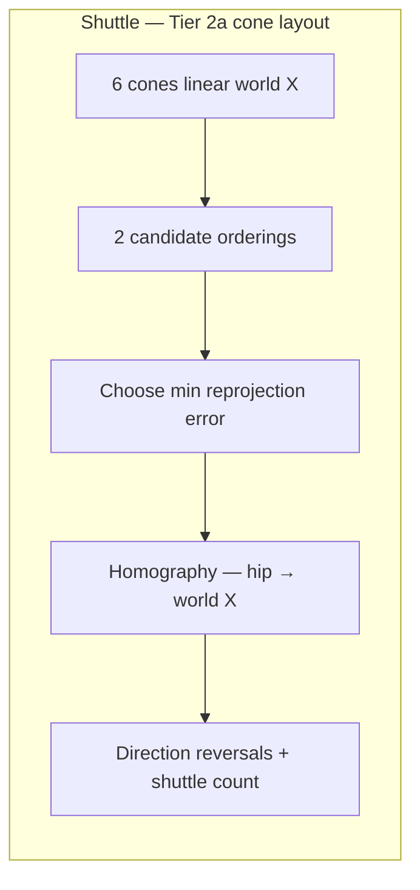

#### Tier 2b: Tape-first depth calibration (Shuttle / fitness linear — higher coach effort)

Same idea as **Sprint Tier 2b**, extended along the **1000 cm** shuttle line: tape establishes depth (along-track) scale with marks at known intervals (e.g. every 200 cm to match nominal cone spacing). **Optional cones** at waypoints or ends provide horizontal emphasis and help the tracker, but depth correspondence is anchored by tape first.

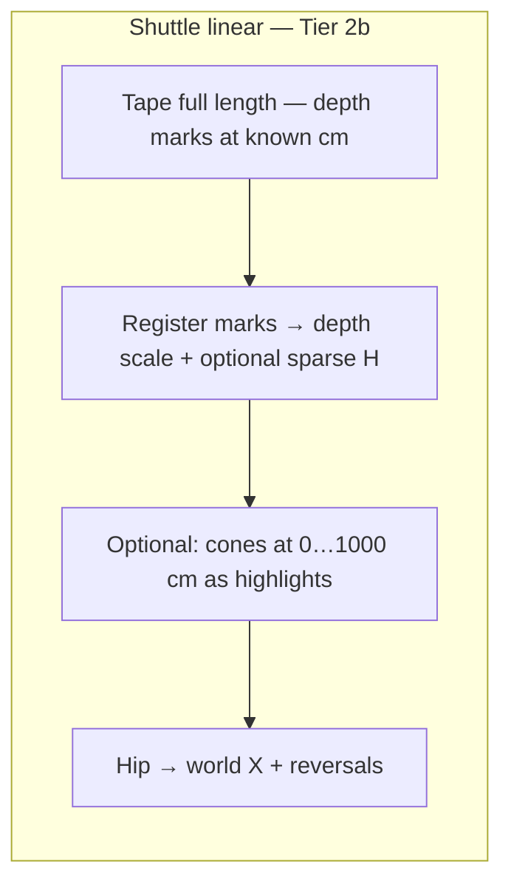

**Trade-off**: Same as Sprint — more physical setup; useful when full cone counts are hard to detect reliably.

---

### 4. Fitness (Grid Calibration)

| Property | Value |
|----------|-------|
| **Pattern** | `"grid"` — 6 rows × 7 cols = 42 cones |
| **Method** | Homography |
| **Requires valid calibration** | Yes |
| **Detector** | SAM3 prompt |

**This is the most complex calibration** due to grid size, asymmetric spacing, and oblique camera angle.

**Grid layout**: 70 cm X-spacing, 200 cm Y-spacing (asymmetric).

**Three-level fallback correspondence solving**:
1. **D4 exhaustive search** — tries all 8 rotation/reflection variants (4 rotations × 2 reflections). Works when exact cone count detected.
2. **Partial grid correspondence** (`_partial_grid_correspondence`) — handles missing/extra cones via iterative nearest-neighbour assignment with confidence-priority greedy matching. Uses row-structured H initialisation for oblique cameras.
3. **Iterative grid fit** (`_fit_grid_iterative`) — last resort. Initialises H from centroid + isotropic scale, iterates NN assignment + DLT refit.

**Camera extrinsics initialisation**: For oblique "behind" cameras, auto-fits tilt angle, focal length, and camera position using `scipy.optimize.minimize` (L-BFGS-B) with multi-start optimisation.

**Config highlights**:
```json
{
  "cone_layout": {
    "pattern": "grid",
    "first_cone_cm": [0, 0],
    "spacing_cm_x": 70,
    "spacing_cm_y": 200,
    "rows": 6,
    "cols": 7,
    "grid_fit_use_iterative": true,
    "grid_fit_max_iters": 30,
    "grid_fit_match_radius_px": 150,
    "grid_fit_min_inliers": 10,
    "camera_orientation": "behind",
    "reproj_error_threshold_cm": 28
  }
}
```

**Known issue**: Near-singular H (condition numbers 9e7–2e8) from behind-view geometry. High reproj error threshold (28 cm) needed. Row-structured H initialisation (Fix 6) specifically addresses the 10× scale difference between X and Y axes in oblique views.

#### Tier 2a: Full cone grid (default)

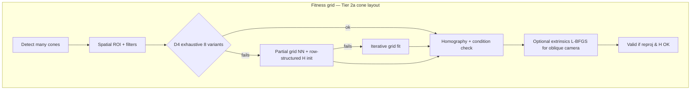

#### Tier 2b: Tape-first depth + optional horizontal markers (Fitness grid — higher coach effort)

**Intent**: Oblique grid calibration is sensitive to **depth (Y)**. A long tape can be run **along each row** (or along a central depth line) so known depth intervals are fixed before relying on 42 cone detections. **Optional cones** remain for **horizontal structure** — column alignment, row ends, and visual matching — but tape reduces dependence on dense cone correspondence for the depth axis.

**Process (conceptual)**:

1. **Depth**: Lay tape(s) parallel to the depth axis at known Y-spacing (e.g. 200 cm rows) or one central tape with transverse marks; register pixel↔cm along depth.
2. **Horizontal**: Optional cones at grid corners or row ends to anchor X and tie tape to the configured `spacing_cm_x` / `spacing_cm_y` layout.
3. **Solver**: Combine tape-derived depth constraints with partial cone grid matching, or initialise homography from depth-from-tape + sparse lateral points.

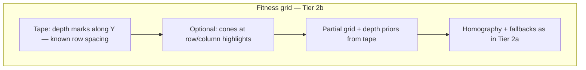

**Trade-off**: Highest coach effort (tape layout on a large grid) but can stabilise H when behind-camera perspective makes cone-only fits ill-conditioned.

---

### 5. Balance (Single-Leg Stance)

| Property | Value |
|----------|-------|
| **Pattern** | N/A |
| **Method** | None |
| **Requires valid calibration** | No |

**No calibration needed.** Balance uses purely temporal analysis:
- Establishes ankle Y baseline from first 30 frames
- Detects ankle lift (Y < baseline - threshold)
- State machine: BILATERAL → BALANCING → FAILED

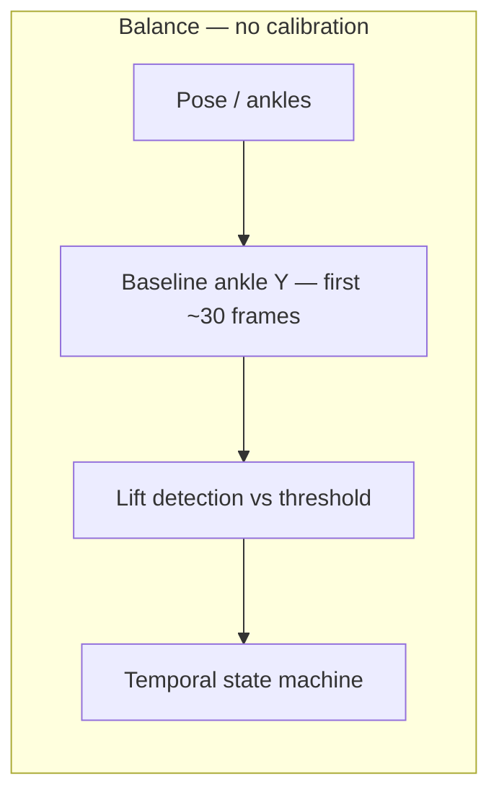

---

### 6. Explosiveness (Vertical Jump)

| Property | Value |
|----------|-------|
| **Pattern** | N/A |
| **Method** | Single-axis (`pixels_per_cm`) |
| **Requires valid calibration** | No (guard disabled) |

**Calibration**: `calibrate_single_axis()` computes vertical px/cm from a reference object height (default 23 cm, typically a cone height).

**Jump measurement**: Standing baseline from first 30 frames → detect jump events → apex = min ankle Y during jump → height (px) converted to cm via `pixels_per_cm`.

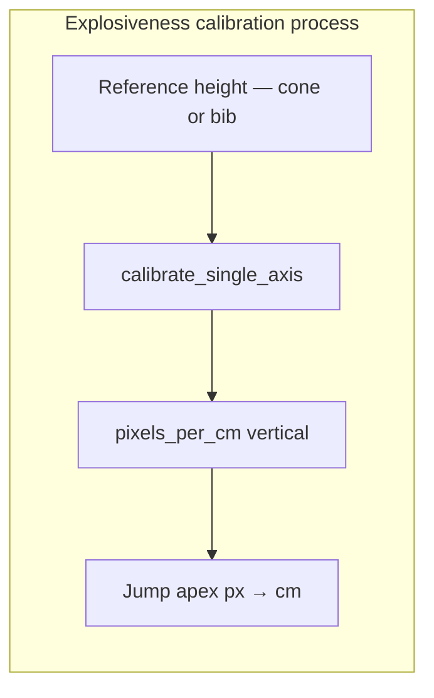

---

## Cone Calibration Workflow (User-Facing)

This is the intended workflow for tests that require cone layouts to validate that cones are correctly positioned within the camera's field of view.

### Step-by-Step Flow

#### 1. User Places Two Reference Cones
The user places cones at the **bottom-left** and **top-right** corners of the test area. These define the bounding box of the test zone in the camera view.

#### 2. FOV Validation Check
The system captures a frame and verifies:
- Both reference cones are detected (via HSV or SAM3)
- Both cones are within the camera's field of view
- The bounding box formed by the two cones encompasses the full test area

**Check**: If either cone is not visible or falls outside the frame, the user is prompted to reposition the camera or cones.

#### 3. Regular Y-Pattern Calibration
For tests that use cone layouts (shuttle, fitness, agility), a **regular pattern laid along the Y-axis in world coordinates** is used:

- Cones are placed at known Y-intervals in world space (e.g., every 200 cm for fitness rows)
- The Y-axis in world coordinates corresponds to depth from camera
- This gives the calibration system a consistent reference frame

**Why Y-axis**: The camera typically looks along the depth axis (Y in world coords). A regular Y-spacing pattern provides good geometric conditioning for the homography because it spans the depth of the scene, which is where perspective distortion is greatest.

#### 4. Full Cone Layout Placement
After FOV validation, the user places all cones for the specific test layout:
- **Linear tests** (shuttle, sprint): cones along one axis at regular spacing
- **Grid tests** (fitness): rows × cols grid with potentially asymmetric X/Y spacing
- **Irregular tests** (agility): specific positions per the test protocol

#### 5. Calibration Execution
The system:
1. Detects all cones in the frame
2. Applies spatial ROI filtering to exclude cones from other setups
3. Solves pixel↔world correspondence using the appropriate method for the layout pattern
4. Computes the homography matrix
5. Validates via reprojection error threshold
6. Returns `CalibrationResult` with validity flag

#### 6. User Feedback
- **Valid**: Green indicator, show reprojection error. Proceed to recording.
- **Invalid**: Red indicator, show diagnostic info (which cones failed, reprojection error). Prompt user to adjust cones or camera and retry.

### Diagram: cone calibration workflow (high level)

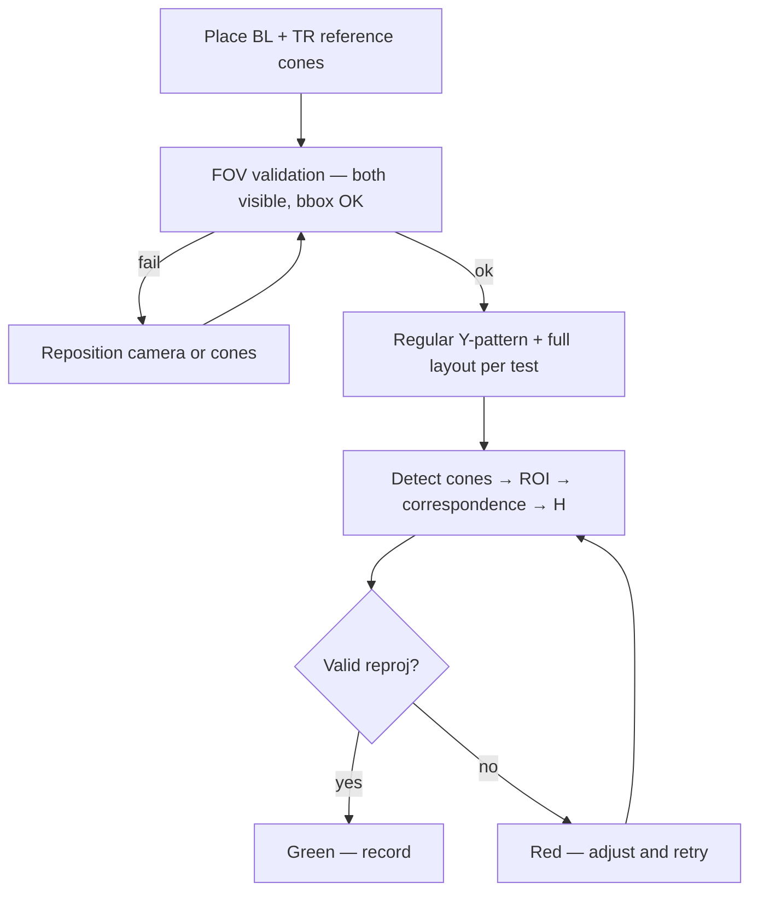

---

## Key Thresholds & Parameters

| Parameter | Default | Purpose |
|-----------|---------|---------|
| `REPROJ_ERROR_THRESHOLD_CM` | 1.5 cm | Global validity threshold |
| `reproj_error_threshold_cm` (config) | Per test | Override threshold (e.g., 28 cm for fitness grid) |
| `CONDITION_NUMBER_WARN` | 1e7 | Flags marginal geometry |
| `CONDITION_NUMBER_REJECT` | 1e9 | Rejects degenerate H matrices |
| `min_cone_area` | 100 px² | Minimum contour area for HSV detection |
| `min_confidence` | 0.5 | Detection confidence filter |
| `match_radius_px` | 60 px | NN assignment radius for partial grids |
| `grid_fit_match_radius_px` | 150 px | Wider radius for fitness grid |

---

## Lessons Learned (from calibration research)

1. **Over-detection is the primary failure mode** when multiple test setups share the same gym floor. Spatial ROI filtering is essential.
2. **Oblique camera angles** (filming from behind/above) create extreme perspective distortion. Row-structured H initialisation and camera extrinsics fitting are needed.
3. **Asymmetric grid spacing** (70 cm X vs 200 cm Y for fitness) requires separate `spacing_cm_x` / `spacing_cm_y` config support.
4. **Condition number monitoring** prevents silently bad homographies from propagating to test extractors.
5. **The calibration guard** in `BaseMetricExtractor` is the last line of defence — tests that require valid calibration will raise `CalibrationError` rather than produce garbage results.
6. **Sprint (single-axis)** is the only test that reliably calibrates in current footage because it doesn't need a full homography.

---

## Data Flow

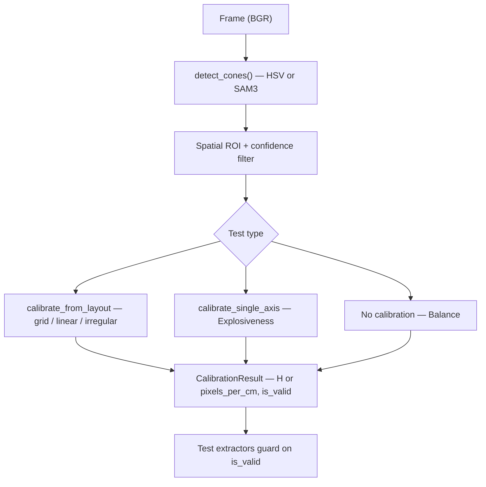

<details>
<summary>ASCII version (same content)</summary>

```
Frame (BGR)
  │
  ├─ detect_cones() → ConeDetection[]
  │    ├─ HSV segmentation + contour centroids
  │    └─ SAM3 prompt-based masks
  │
  ├─ Spatial ROI filter (exclude other test cones)
  ├─ Confidence filter
  │
  ├─ calibrate_from_layout() ─── Grid/Linear/Irregular
  │    ├─ Camera extrinsics H initialisation (optional)
  │    ├─ solve_correspondence() ─── D4 exhaustive
  │    ├─ _partial_grid_correspondence() ─── iterative NN
  │    └─ _fit_grid_iterative() ─── last resort
  │
  ├─ calibrate_single_axis() ─── Explosiveness
  │
  └─ CalibrationResult
       ├─ method: "homography" | "single_axis"
       ├─ homography_matrix / pixels_per_cm
       ├─ reprojection_error_cm
       └─ is_valid
           │
           └─ Test Extractors guard on is_valid
```

</details>
